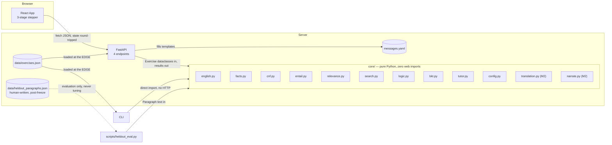

# ProofPilot — High-Level Design v2.7

Team: CVS Ujwal (24BCE0667), Keshav Raj (24BCI0306)
Repo: public, MIT license, GitHub user `ujwal2311`
Status: **APPROVED AND FROZEN** (2026-10-08; v2.3 budget caps, v2.4 config-at-the-edge — both approved change requests).
This document is the source of truth. Any later
design change requires an explicit change request from the student; Claude must not alter the
design unilaterally.

**v2.4 = v2.3 + config-at-the-edge (§16). v2.3 = v2.2 + an approved line-cap change request (§16, budgets only — no behaviour, algorithm,
contract or scope changed).** **v2.2 = v2.1 + the student's §15 decisions** (budget accepted, core cap raised to 975, pilot kept
in M1, hints defined for non-entailing exercises, module ownership recorded). v2.1 itself added
the milestone split, 9 required fixes, and an adversarial re-verification (§17) that found and
fixed **7 BLOCKERs** in the v2.0 design.

**Headline numbers, computed bottom-up in §13, never rounded to fit:** after all approved cuts,
**77.00 person-hours ≈ 38.5 h per member** for a 2-person team. This is **+10.75 h above the
66.25 h figure approved in v2.1**, and every hour of that delta is traceable to two decisions the
student made in this round: keeping the pilot in M1 (**+2.00**) and requiring that *both members
can explain every module* (**+8.75** of cross-module walkthroughs). The second is the right call
for the viva and is budgeted rather than hidden. Core lines land at **~945 against the new 975
cap ✓**, and as of v2.3 **all five line and hour caps are met** (§13.4).

---

## 1. Purpose, Problem, Formative Angle

A student learning propositional logic has to do two hard things: turn an English argument into
formulas, and then prove it. Most tools help with neither — they check a final answer. ProofPilot
reads a short paragraph and a claimed conclusion, shows the student exactly which facts it found
and asks them to confirm, decides by truth table whether the conclusion actually follows, and then
coaches a resolution refutation step by step with exact diagnosis of each mistake and
BFS-computed hints. Bayesian Knowledge Tracing over three skills (four in M2) chooses the next
exercise and decides when to stop.

The system never claims to understand free-form English. It supports one precisely documented
controlled grammar (§3) and refuses anything outside it with a named error and a rephrasing hint.
Refusing is a feature, not a failure: a wrong silent guess about what a sentence means would
corrupt every downstream stage.

## 2. Milestones, Scope, Budgets

### M1 — "English-reading proof tutor" (MUST SHIP, target ≤50 h)

`english.py` (grammar) · `facts.py` (exact-key auto-merge + **manual** merge only; no similarity
suggestions) · `cnf.py` · `entail.py` (truth-table entailment, `INCONSISTENT_PREMISES`,
does-not-follow + counterexample) · `relevance.py` · `logic.py` · `search.py` (exact BFS + node
cap + rule-based fallback hint; **no set-of-support**) · `bkt.py` (3 skills: CLASH, RESOLVE,
STRATEGY) · `tutor.py` · CLI · 4-endpoint API · React with **3 stages** (Read & Facts → Prove →
Explanation panel) · simulation + one graph · held-out parser evaluation · tests · README ·
GitHub · AI log.

### M2 — "Translation coach" (target ≤15 h)

`translation.py` (truth-table equivalence; contrapositive accepted; **exactly 3 diagnoses** —
`CONVERSE`, `MISSING_NEGATION`, `AND_OR_SWAP` — otherwise `NOT_EQUIVALENT`; **always** one English
counterexample row) · TRANSLATE as the 4th BKT skill · a typed formula input (`R -> C`) with
insert buttons, **no drag-and-drop builder** · `narrate.py` (English proof explanation).

### STRETCH (listed only, not designed)

Similarity (Jaccard) merge suggestions · set-of-support search · "Why this score?" ·
mobile polish · more translation diagnoses · teacher-authored questions.

### Out of scope (all milestones)

Free-form NLP, LLMs, first-order logic (all/some/every), pronoun resolution, tense/time
reasoning, "because/since" causality, multiple languages, a teacher dashboard, accounts, a
database, Docker, A*.

### Budgets (changed from v1 — justified in §12)

| Budget | Cap (v2.3) | Scope |
|---|---|---|
| Hours | **77.00 person-hours accepted** (≈38.5 h each); contingency 75.00 | includes review-and-understand time **and** cross-module walkthroughs (§13.3) |
| Core lines | **≤975** | `backend/src/core/*.py` |
| api + cli | **≤350** | `backend/src/api/*.py` + `backend/src/cli.py`, excluding tests |
| scripts | **≤250** (separate cap) | `scripts/*.py` — build/eval tooling, never shipped |
| Frontend | **≤700** | `frontend/src/**` |

All five caps are now **met** by the §13.4 estimates. The v2.2 deferrals are closed — see §16
(v2.3) for the one-line justification behind each number.

**Team constraint (approved):** both members must be able to explain every module. This is a
budget line item (§13.3), not an aspiration — it is what the §17.11 three-sentence explanations
and the joint walkthroughs exist to deliver.

**Bank constraint:** every exercise in `data/exercises.json` must reduce to **≤7 relevant clauses
after the relevance filter**. Own-question mode may exceed this; it degrades via the node cap +
rule-based fallback hint, never by hanging.

---

## 3. Supported-Language Specification (`core/english.py`)

### 3.1 Normalization (whole sentence, before parsing)
**Unicode folding first, in one place** (`english.normalize_text`): curly quotes `‘ ’ “ ”` → ASCII,
en/em dashes `– —` → `-`, non-breaking spaces → space. Then lowercase → expand contractions
(`isn't→is not`, `doesn't→does not`, `won't→will not`, `can't→can not`) → split into sentences.
The order is load-bearing: a curly apostrophe surviving to the contraction table leaves `isn’t`
as a content word and the negation is lost before `facts.py` sees it.

**Sentence splitting (v2.5).** A terminator `. ! ? ;` ends a sentence only when the next
non-space character is uppercase, or nothing follows; and a `.` between two digits never splits.
This keeps `3.5`, `1,000.50` and `e.g.` intact. `Dr. Rao` still splits — distinguishing an
abbreviation from a sentence end needs a lexicon, which is topic knowledge the no-hardcoding
principle forbids, so the fragment stays visible on the Facts screen instead (§14).

### 3.2 Grammar

A `clause` **never contains a connective**. This single property is what makes the whole pipeline
tractable (§6.1) and is also the source of the system's most important limitation (§14.1).

```
sentence := "if" cond ("," | "then")+ junction      # consequent runs to end of sentence
          | "unless" clause "," junction             # sentence-initial; ≡ junction ∨ clause
          | clause "if" cond                         # B if A  ≡  A → B
          | clause "only if" clause                  # A only if B  ≡  A → B
          | clause "unless" clause                   # A unless B  ≡  A ∨ B
          | clause "if and only if" clause           # A ↔ B
          | "either" or_junction                     # "either" forces pure-or
          | "both"   and_junction                    # "both"   forces pure-and
          | "neither" clause ("nor" clause)+         # ¬A ∧ ¬B ∧ …
          | junction                                 # fallback

cond         := junction
junction     := clause (("and" | "or") clause)*      # mixing and/or → AMBIGUOUS_AND_OR
or_junction  := clause ("or"  clause)+               # an "and" here → AMBIGUOUS_AND_OR
and_junction := clause ("and" clause)+               # an "or"  here → AMBIGUOUS_AND_OR

clause   := ["not" | "it is not the case that"] FACT_PHRASE
```

**Two corrections to the brief's grammar, applied rather than parked** (both are directly implied
by the brief's own text, so neither is a design fork):

1. The consequent of `if … then …` is a `junction`, not a bare `clause` — otherwise the brief's
   own note *"in 'if A then B and C', the consequent runs to the end of the sentence"* cannot be
   constructed.
2. `either` / `both` are **n-ary disambiguating prefixes**, not fixed 2-clause forms. The brief
   assigns them exactly this job ("mixing and/or without `both`/`either` → AMBIGUOUS"), and
   treating them as prefixes that *force* a pure-or / pure-and junction handles
   "Either A or B or C" with no extra machinery. `neither … nor … nor …` is n-ary for the same
   reason.

**`"Only if B, A"` is REJECTED** (`UNPARSEABLE`, hint: *"rewrite as 'A only if B'"*). English
requires subject-auxiliary inversion here ("Only if B **does** A happen"), which this grammar
cannot detect; accepting the uninverted form risks silently reversing the implication direction.
Rejecting is the never-guess-compliant choice. (`"Unless B, A"` **is** supported — see §3.2 — and
is unambiguous because `unless` is symmetric in neither reading.)

### 3.3 Meanings

| Pattern | Formula | Clausal form |
|---|---|---|
| `if A then B` / `B if A` | A→B | `{¬A, B}` |
| `A only if B` | A→B | `{¬A, B}` |
| `A unless B` / `Unless B, A` | A∨B | `{A, B}` |
| `either A or B` | A∨B (inclusive) | `{A, B}` |
| `neither A nor B` | ¬A∧¬B | `{¬A}, {¬B}` |
| `A if and only if B` | (A→B)∧(B→A) | `{¬A,B}, {¬B,A}` |
| `both A and B` / `A and B` | A∧B | `{A}, {B}` |
| `A or B` | A∨B | `{A, B}` |
| bare clause `A` / `not A` | A / ¬A | `{A}` / `{¬A}` |

**Keyword matching is longest-first**, and this ordering is load-bearing, not cosmetic:
`"if and only if"` (4 tokens) **>** `"only if"` (2) **>** `"if"` (1); and `either…or` /
`neither…nor` are matched **before** a bare `or`. Scanning for `"if"` first would read
*"A if and only if B"* as *"B if A"* — the wrong formula, silently. Tested by
`test_keyword_longest_first_ordering` and `test_either_neither_before_bare_or`.

**Negation composes by XOR, and the two layers are strictly separated** (v2.5 clarification):

- **Structural negation** is a negator that *begins* a clause — `not` or `it is not the case
  that`, exactly as the production above writes it. `english.py` strips it and records a `Not`
  node. Two structural negations cancel rather than stack.
- **Embedded negation** is `not`/`no`/`never` appearing anywhere else inside the phrase.
  `english.py` must **not** touch it; it stays in the phrase text and `facts.py` resolves it when
  it computes the fact's polarity.

So *"It is not raining"* yields `Atom("it is not raining")` from the parser — **not** a `Not`
node — and becomes ¬R only after `facts.py` reads the embedded negation. Whereas *"it is not the
case that it does not rain"* yields `Not(Atom("it does not rain"))`, and the two polarities
cancel to **R** (positive). Getting this boundary backwards would corrupt every later stage, so
it is pinned by `test_embedded_negation_stays_inside_the_fact_phrase`.

### 3.5 Stemming (v2.6) — uniform, and idempotent by construction

Applied by `facts.py` to **every** token unconditionally — never "only if a suffix was stripped" —
and the whole pipeline repeats to a fixpoint, so a base form and an inflected form follow the
same path and `stem(stem(w)) == stem(w)` holds:

1. **suffix**, first match only: `sses→ss` | `ies→i` | `ss→ss` *(no-op; protects class, miss)* |
   `ing→` | `ed→` | `es→` | `s→`
2. **drop a trailing `e`**
3. **collapse a doubled final consonant** (`ll→l`), except `ss`
4. **`y→i` only after a consonant** — `study→studi`, but `stay` is unchanged

Each step is skipped if it would leave fewer than **2** characters. The fixpoint is what makes
base and inflected forms meet: `buses→bus→bu` reaches the same key as `bus→bu`, which a single
pass would not. Measured over 36 pairs: 36 merges, 0 misses, 0 idempotence violations.

**Known false merges, accepted deliberately:** `hoping`/`hopping`, `caning`/`canning`,
`planed`/`planned` all collide, because step 3 cannot tell a doubled consonant that marks a short
vowel from one that does not. These are *safe* because of A1 — a merged fact shows every phrase
it absorbed, so the student sees both and can split them.

### 3.4 Errors (never guess)

| Code | Trigger | Level |
|---|---|---|
| `UNPARSEABLE` | No production matches (incl. `"Only if B, A"`) | per-sentence |
| `AMBIGUOUS_AND_OR` | Junction mixes and/or without `both`/`either` | per-sentence |
| `QUANTIFIER_UNSUPPORTED` | all / every / some / any / none / nobody / everyone | per-sentence |
| `TOO_LONG` | sentence > 30 words | per-sentence |
| `EMPTY_FACT_PHRASE` | a clause's canonical key is empty after normalization (e.g. *"it is"*) | per-sentence |
| `SUSPICIOUS_FRAGMENT` | splitting produced a one-token fragment (`"Dr"` from `"Dr. Rao"`) | paragraph-level, halts |
| `UNKNOWN_PHRASE` | a merge names a phrase no sentence produced | merge-time |
| `SELF_MERGE` | a merge names the same phrase twice | merge-time |
| `CONFLICTING_MERGE` | one phrase pair given two different relations | merge-time |
| `TOO_MANY_FACTS` | > 10 distinct facts across paragraph + conclusion | paragraph-level, halts |
| `TOO_MANY_SENTENCES` | > 12 sentences | paragraph-level, halts |

Per-sentence errors do **not** block the other sentences — the Facts screen shows every sentence
with its status. Every error names the offending sentence and gives exactly one rephrasing hint.

`EMPTY_FACT_PHRASE` is **new in v2.1** (found in the §17.4 normalization audit): a phrase made
entirely of function words would otherwise produce a fact with an empty key, silently merging
with every other such phrase.

---

## 4. Architecture



**Core reads no files.** Every data file is loaded by an edge — the API, the CLI, or a script —
and passed in as plain dataclasses. Core therefore imports nothing outside the standard library
(enforced by the allowlist in `test_smoke.py`) and every module is unit-testable from literals
with no fixture files on disk.

| Module | Owns | Does NOT own | M |
|---|---|---|---|
| `core/english.py` | Normalize, tokenize, longest-first keyword scan, parse → AST, the 7 error codes | Fact identity, CNF | M1 |
| `core/facts.py` | Embedded-negation extraction, function-word + suffix normalization, canonical keys, symbol assignment, manual merges | Parsing, similarity scoring (stretch) | M1 |
| `core/cnf.py` | AST → clauses by the **textbook 3-step algorithm** (§6.2) | Parsing, resolution | M1 |
| `core/entail.py` | Truth-table entailment, inconsistency, counterexample row | Search, resolution | M1 |
| `core/relevance.py` | Fact-graph BFS; which clauses are needed | Search, hints | M1 |
| `core/search.py` | Exact BFS distance, best next step, productivity, node cap, rule-based fallback hint | Diagnosis, mastery | M1 |
| `core/logic.py` | Literal normalization, resolvents, 6-code step diagnosis | Search, CNF | M1 |
| `core/bkt.py` | Single-skill Bayesian update + parameter validation | Which skills to update | M1 |
| `core/tutor.py` | Evidence mapping, mastery update orchestration, next-exercise selection, done check | The BKT math | M1 |
| `core/config.py` | **Every** numeric limit and seed, as named constants | Any logic | M1 |
| `core/translation.py` | Symbolic formula parsing, equivalence, 3 diagnoses, counterexample | The reference parse | M2 |
| `core/narrate.py` | Finished proof → English prose | Step-level feedback (that's `messages.yaml`) | M2 |
| `core/models.py` | The dataclasses crossing the edge↔core boundary (`Exercise`, …). **Not** `types.py`: that shadows a standard-library module, and a core file silently taking precedence over `types` is the kind of bug that costs an afternoon (v2.7 A2) | Reading any file | M1 |
| `messages.yaml` | All user-facing text templates | Any decision logic | M1 |
| `backend/src/loader.py` | **Reads `data/exercises.json` and returns `list[Exercise]`.** The only module that touches that file | Any logic — it validates shape and stops | M1 |
| `backend/api` | Schemas, routing, ID↔clause mapping, error status codes, CORS, **calling the loader at startup** | Any logic | M1 |
| `backend/src/cli.py` | Plays a full practice session against core directly, **calling the loader itself** | HTTP, React | M1 |
| `frontend/src` | Render, post actions, persist to localStorage | Validating anything, computing anything | M1/M2 |

### 4.1 Module ownership

Both members work on the project jointly; the A/B split below assigns **review ownership and the
primary viva explainer** for each module, not exclusive authorship. **Both members review each
other's modules, and both must be able to explain every module** (§13.3 budgets the walkthroughs
that make this true). Name assignment is left blank here and filled in by the team in
`docs/report/CONTRIBUTION_TEMPLATE.md`, which is the document the professor grades on
contribution.

| Owner | Modules | M1 h | M2 h |
|---|---|---|---|
| **Member A** | `english.py`, `facts.py`, `cnf.py`, `entail.py`, `relevance.py` (+ `translation.py` in M2) | 15.00 | 4.75 |
| **Member B** | `logic.py`, `search.py`, `bkt.py`, `tutor.py`, the API, the frontend | 20.25 | 3.75 |
| **Shared** | `config.py`, `messages.yaml`, CLI, scripts, data authoring, experiments, pilot, README, repo/CI, integration debugging, cross-module walkthroughs | 30.25 | 3.00 |

**Load-balance note (planning estimate, not a result).** Owned work alone splits 19.75 h (A) to
24.00 h (B) — B carries the API and the frontend on top of four core modules. To land both members
near 38.5 h, the 33.25 h shared pool should split roughly **19 h to A / 14 h to B**; the natural
allocation is for A to take the CLI, the scripts and the data authoring. This is a scheduling
suggestion, not a contract.

```text
# --- crosses the edge -> core boundary (core/types.py). Core never reads a file. ---
Exercise    = { id: str, paragraph: str, conclusion: str, topic: str }
              # exactly the four fields in data/exercises.json; difficulty is COMPUTED
              # (scripts/difficulty.py), never stored, never hand-labelled

Fact        = { symbol: str, phrases: tuple[str, ...] }
              # EVERY phrase merged into this fact, first-appearance order (v2.6 A1), so the
              # Facts screen can show them all and an auto-merge stays visible and splittable.
MergeChoice = { a: str, b: str, relation: "same"|"opposite"|"different" }
              # a and b are PHRASES, not symbols (v2.6 A1): a symbol cannot name one half of a
              # group it already contains. "different" SPLITS what the stemmer merged.
Clause      = frozenset[str]                        # literals "P" / "~P"; empty clause = frozenset()
ClauseRec   = { id: str, literals: list[str], origin: "given"|"goal"|"derived",
                source_sentence_id: str|None }      # origin trace, used by the Explanation panel
SentenceRec = { id, text, status: "ok"|"error", error_code: str|None,
                formula: str|None, symbols: list[str] }
Translation = { sentence_id, student_formula: str|None,                       # M2
                status: "pending"|"correct"|"correct_contrapositive"|"error",
                diagnosis_code: str|None }
HistoryItem = { skill, step_index: int, outcome: bool }

State:
{
  schema_version:  int,                    # bumped on any shape change; localStorage guard
  mode:            "practice" | "own_question",
  exercise_id:     str | null,
  stage:           "read" | "facts" | "prove" | "explain",      # M2 inserts "translate" before "prove"
  paragraph, conclusion: str,
  facts:           list[Fact],
  sentences:       list[SentenceRec],      # paragraph sentences in order, conclusion last
  merges_applied:  list[MergeChoice],      # the user's merge/split decisions, replayed in order
  translations:    list[Translation],      # M2 only; empty in M1
  clauses:         list[ClauseRec],        # CNF of the REFERENCE parse, append-only, stable IDs
  relevant_ids:    list[str],              # output of relevance.py; informational, nothing is deleted
  mastery:         { CLASH, RESOLVE, STRATEGY [, TRANSLATE] : float },
  mastery_history: list[HistoryItem],
  hint_level:      int,                    # 0-3; resets on stage change or a clause being added
  done_ids:        list[str],
  solved:          bool,
  entailment:      { status: "entails"|"does_not_follow"|"inconsistent",
                     counterexample: {symbol: bool} | null }
}
```

Clauses always come from the **reference** parse, never from the student's M2 formulas. In M2 the
Translate stage gates progression, so by the time `stage="prove"` every student formula is already
*logically equivalent* to the reference — re-deriving CNF from their formula would create a second
conversion path that could disagree with the first over nothing more interesting than literal
ordering. One CNF source of truth.

---

## 6. Algorithms (each with its correctness argument)

### 6.1 Parsing
Because a `clause` contains no connective, every sentence has **at most one top-level connective
construct**. A single left-to-right longest-first scan therefore finds it without backtracking;
if none is found, the sentence is a `junction`. Correctness: the scan is complete (it tries every
production's keyword) and unambiguous (longest-first resolves the only overlapping keywords,
`if` / `only if` / `if and only if`). Depth is bounded at 3 (connective → junction → clause).

### 6.2 CNF — textbook algorithm, chosen over the 9-case lookup

**v2.0 specified a fixed-case lookup. v2.1 replaces it with the textbook 3-step algorithm.** The
comparison the brief asked for:

| Criterion | 9-case lookup | Textbook 3-step | Winner |
|---|---|---|---|
| Lines | ~70–85. The "9 cases" is a fiction: `cond` and `junction` are *n-ary*, so `(A∨B)→(C∧D)` needs nested loops producing m×n clauses, and each of the 9 shapes needs its own loop | ~55. `eliminate_iff_implies` ~12, `push_negation` (De Morgan) ~15, `distribute_or_over_and` ~15, `to_clauses` (dedupe + drop tautologies) ~13 | **textbook** |
| Explainability | "we enumerated the cases" — a viva examiner asks *"did you prove the enumeration is complete?"* and the answer is a hand-wave | "this is the standard CNF conversion in any logic textbook" — a named, citable algorithm | **textbook** |
| Bug risk | 9 independent hand-derived transformations = 9 independent chances to get a sign wrong; a missed case is a silent wrong answer | 3 generic transformations exercised by every production; a sign error breaks many tests at once, loudly | **textbook** |

The usual objection to general CNF conversion — exponential blow-up from distribution — **does
not apply here**, and this is provable rather than hopeful: formula depth is ≤3, so the worst case
is `(A₁∨…∨Aₘ) → (B₁∧…∧Bₙ)` yielding exactly m×n clauses, with m+n ≤ 10 facts, so **≤25 clauses**.
Bounded, small, no cap needed.

Every grammar production is pushed through CNF and checked in
`test_cnf_every_production` (§10) — the lookup's only real advantage (you can eyeball each case)
is recovered by testing, not by structure.

### 6.3 Fact normalization
Canonical key = **ordered tuple** of stems after (1) embedded-negation extraction, (2) function-word
removal, (3) stemming (§3.5). The key is *ordered*, so *"dog bites man"* and *"man bites dog"* stay
distinct. Exact key match ⇒ automatic merge (safe: identical keys mean identical content words in
identical order). Anything less than an exact match is **never** merged automatically — the user
merges manually on the Facts screen. Risks audited in §17.4.

**The function-word list lives in exactly one place: `facts.FUNCTION_WORDS`** (v2.7 A5). It is not
repeated here, because two copies drift. What belongs in it, and why:

- **Articles** (`a`, `an`, `the`) and **auxiliaries** (`is`, `was`, `does`, `will`, `got`, …) carry
  no propositional content — dropping them lets *"the bus is late"* and *"a bus was late"* name one
  fact.
- **`it` and `there` are included** because in this grammar they appear as *expletive* (dummy)
  subjects — *"it rains"*, *"it is cold"*, *"there is a delay"* — where the word refers to nothing
  at all. Keeping them would leave *"it rains"* and *"rain is falling"* as separate facts for no
  reason, and §3.4's own `EMPTY_FACT_PHRASE` example (*"it is"*) only empties if `it` is dropped.
- **Personal pronouns (`he`, `she`, `they`, `we`, …) are deliberately NOT included.** They *refer
  to an entity*, so dropping them would merge *"he waits"* with *"she waits"*. Resolving who they
  refer to is pronoun resolution, which §2 puts out of scope — so the honest treatment is to leave
  them as ordinary content words and let the student see the result on the Facts screen.
- Nothing topic-specific may ever be added; `test_function_word_list_is_grammar_not_topic_knowledge`
  enforces that.

### 6.4 Entailment
`KB ⊨ goal` ⟺ no row of the truth table over all facts makes every KB clause true and the goal
false — the textbook definition, decided exhaustively over ≤2¹⁰ = 1024 rows. If **no** row
satisfies the KB, the premises are inconsistent; this is checked **first**, because entailment is
vacuously true from a contradiction and hiding that would be dishonest. Rows are enumerated as a
binary counter over alphabetically sorted symbols, so the reported counterexample is deterministic.

### 6.5 Relevance filter — correctness argument
Let R = clauses BFS-reachable from the goal's facts in the graph {clauses as nodes, edge iff they
share a fact}, and U = the rest. By construction facts(U) ∩ (facts(R) ∪ facts(goal)) = ∅.
**Claim:** if KB ⊨ goal then R ∪ {¬goal} is already unsatisfiable, so dropping U removes no needed
clause. *Proof:* suppose σ_R satisfies R ∪ {¬goal}. Since the consistency check passed, KB is
satisfiable by some σ; restrict it to facts(U) to get σ_U. The domains are disjoint, so σ_R ⊎ σ_U
is well-defined and satisfies KB ∪ {¬goal} — contradicting KB ⊨ goal. ∎

**The consistency check must run before the filter.** If KB were inconsistent the contradiction
could live entirely inside U, and dropping U would destroy the only refutation. §7 mandates the
ordering; `test_relevance_requires_consistency_first` locks it.

Nothing is deleted from `state.clauses` — the filter populates `relevant_ids` and the
"not needed for this conclusion" report, and shapes hints only. The student may use any clause.

### 6.6 Search
Exact BFS over states (state = frozenset of clauses; action = add one new non-tautological
single-pivot resolvent; cost 1; goal = `frozenset()` ∈ state), with a visited set and canonical
successor ordering. **Set-of-support is removed** (stretch), so there is one regime and one
invariant.

**`productive ⟺ d(new) = d(old) − 1`** still holds. *Proof:* (≤) any derivation from S works from
S∪{C}, so d(S∪{C}) ≤ d(S). (≥) an optimal length-k derivation from S∪{C} that uses C can be
prefixed by the step deriving C from S (C is a resolvent of two clauses in S, since the step was
valid), giving a derivation from S of length ≤ k+1; hence d(S) ≤ d(S∪{C})+1. So
d(new) ∈ {d(old), d(old)−1}. ∎

**Size bound (the v1 review asked for this and never got it).** Order of additions does not matter
— a state is a *set* — so the number of distinct depth-k states is at most C(D, k) where D is the
count of derivable clauses. For a bank exercise (≤7 relevant clauses, ≤6 facts) D is a few dozen;
C(30, 5) = 142,506 is the pessimistic ceiling and real exercises are orders of magnitude smaller.
`max_nodes` is set from a measured benchmark at the Phase-3 gate, not guessed.

**The entailment short-circuit (new in v2.1, fixes BLOCKER V-2).** `search.distance` is **never
called when `entailment.status != "entails"`**. Two of the twelve bank exercises have conclusions
that do not follow — for those the empty clause is *unreachable*, so BFS would exhaust the whole
space to the cap on every single hint request. Since entailment is already decided by truth table
before the Prove stage, the system simply knows: hints fall to the ladder in §6.6.1, and
`productive` is `null`. This turns the node cap back into what it should be — a performance guard
for own-question mode — instead of a crutch covering a known-unreachable goal.

#### 6.6.1 Hints when the conclusion does **not** follow

A student stuck on a non-entailing exercise is stuck for a different reason: there is nothing to
find. The ladder redirects them toward the right action without handing it over at level 1.

| Level | Code | Text |
|---|---|---|
| 1 | `HINT_NOT_FOLLOW_1` | "Before proving, check whether the conclusion really follows." |
| 2 | `HINT_NOT_FOLLOW_2` | "Try to find a situation where all the sentences are true but the conclusion is false." |
| 3 | `HINT_NOT_FOLLOW_3` | "It doesn't follow. Use 'Does not follow'." |

Levels 1 and 2 do not reveal the answer — L2 in particular describes the *method* (look for a
falsifying row) rather than the verdict, so a student who follows it reaches the conclusion
themselves. **Level 3 does reveal it**, deliberately and symmetrically with proof-mode L3, which
hands over the full resolvent. The giveaway is priced by the BKT penalty rather than withheld: a
student who escalates to L3 and then clicks "Does not follow" is scored **STRATEGY wrong** under
the existing hint rule (§9), even though the claim itself is accepted.

**No new evidence rule is needed** — the uniform hint rule already covers this case; §9 now states
it explicitly so it cannot be mistaken for a gap. All three strings live in `messages.yaml` like
every other piece of user-facing text.

**Cap fallback.** On a cap hit: `productive = None`, and the hint falls back to a rule-based
suggestion (prefer resolving with the shortest clause, tie-broken canonically), labelled
"a suggestion, not necessarily the best step".

### 6.7 Resolution diagnosis (unchanged from v1)
Order: `NO_CLASH → DOUBLE_CANCEL → WRONG_RESOLVENT → TAUTOLOGY → DUPLICATE → VALID`. Branches are
mutually exclusive by construction: with ≥2 complementary pairs every single-pivot resolvent
retains the other pair and is a tautology, so `WRONG_RESOLVENT` is only ever reached when exactly
one pivot exists (hence exactly one correct resolvent, no ambiguity in "missing/extra"); and the
double-cancel result differs in size from every single-pivot resolvent, so `DOUBLE_CANCEL` can
never collide with `TAUTOLOGY`.

### 6.8 BKT
`P'_correct = P(1−s) / [P(1−s) + (1−P)g]`; `P'_wrong = Ps / [Ps + (1−P)(1−g)]`;
`P_next = P' + (1−P')T`. Validate `0 < g,s,T,P0 < 1` and `g+s < 1`. Parameters are **assumed, not
fitted** (stated in `config.py` and the README). Re-verified in §17.7.

### 6.9 Translation check (M2)
Equivalence of the student's formula to the reference is decided by a full truth table over the
sentence's facts — exact, never string comparison. If equivalent → `CORRECT`. If equivalent to the
reference's contrapositive *as written* → `CORRECT_CONTRAPOSITIVE` (accepted, with a note).
Otherwise build three mutations of the reference and test equivalence against each in order:
**CONVERSE** (swap antecedent/consequent), **MISSING_NEGATION** (drop one negation), **AND_OR_SWAP**
(toggle the top connective); first match wins, else `NOT_EQUIVALENT`. Always return one
counterexample row in English using the fact labels.

**Why 3 diagnoses lose less than they appear to.** `INVERSE` (¬A→¬B) is logically *equivalent* to
`CONVERSE` (B→A), so a student entering the inverse is already caught — only the label differs.
`ONLY_IF_DIRECTION` (writing B→A for "A only if B") **is** the converse. `UNLESS_ERROR` (writing
A∧B for A∨B) **is** an and/or swap. The three retained codes cover the realistic failure modes of
all six in v2.0's list.

---

## 7. Mandatory Pipeline Ordering

```
parse → facts → consistency → entailment → relevance → proof
```

This order is a correctness requirement, not a convention:
- **consistency before entailment** — entailment is vacuous from a contradiction (§6.4).
- **consistency before relevance** — otherwise the filter can delete the only refutation (§6.5).
- **entailment before any search call** — otherwise an unreachable goal burns the node cap (§6.6).

`test_pipeline_order_enforced` asserts that `relevance` and `search` raise if invoked on a state
whose consistency/entailment has not been resolved.

---

## 8. API Contract and Error Model

Prefix `/api`. Stateless — the full `state` round-trips in every request body. No auth, no
cookies, no server-side session.

| Method | Request | Response |
|---|---|---|
| `GET /api/health` | – | `{ok: true}` |
| `POST /api/next` | `{state?}` | `{state, done}` — practice only; returns a fresh exercise's raw `paragraph`/`conclusion` with `stage="read"`, nothing parsed |
| `POST /api/parse` | `{paragraph, conclusion, merges?}` — each merge is `{a, b, relation}` with **a and b as phrase IDs** (`p1`, `p2`, …), never raw text (v2.7 A3) | `{state, facts, sentences, entailment, removed_sentences, warnings, error?}` — each fact carries `{symbol, phrases: [{id, text}, …]}` so the Facts screen shows every phrase a merge absorbed |
| `POST /api/act` | `{state, action}` | `{code, message, state, extras}` |

`/api/parse` serves both modes and runs the full §7 ordering in one call. The client calls it a
second time with `merges` after the user manually merges facts; merges are **never** inferred.

`action` is a discriminated union on `action.type`:

| `type` | Fields | `extras` | Valid in stage | M |
|---|---|---|---|---|
| `step` | `clause_a, clause_b, resolvent: list[str]` | `{valid, productive}` | `prove` | M1 |
| `hint` | `level: 1\|2\|3` | `{available, reason?, text}` | `prove` | M1 |
| `claim_not_provable` | – | `{accepted, counterexample?}` | `prove` | M1 |
| `translate` | `sentence_id, formula: str` | `{diagnosis_code, counterexample}` | `translate` | M2 |

**`hint` is valid only in `stage="prove"`** (400 otherwise). This is why TRANSLATE evidence is
never hint-affected (§9) — there is no hint in the Translate stage, by design and by schema.

### Error model — every condition maps to exactly one place

| Condition | Mapping |
|---|---|
| Malformed JSON, bad type, literal failing `^~?[A-Z]$` | **HTTP 422** |
| Unknown clause ID; symbol not in this exercise; >20 clauses; >6 literals; action sent in the wrong `stage`; mastery outside (0,1) | **HTTP 400** |
| Unknown `exercise_id` | **HTTP 404** |
| Any action when `solved` or session `done` is already true | **HTTP 409** |
| `TOO_MANY_SENTENCES`, `TOO_MANY_FACTS` | 200, `/api/parse` top-level `error`, halts |
| `UNPARSEABLE`, `AMBIGUOUS_AND_OR`, `QUANTIFIER_UNSUPPORTED`, `TOO_LONG`, `EMPTY_FACT_PHRASE` | 200, per-sentence `SentenceRec.status="error"` |
| `INCONSISTENT_PREMISES`, `DOES_NOT_FOLLOW` | 200, `entailment.status` |
| `NO_CLASH … VALID` | 200, `code` |
| `CLAIM_ACCEPTED` / `CLAIM_REJECTED` | 200, `extras.accepted` |
| `HINT_1/2/3`, `HINT_UNAVAILABLE`, `HINT_FALLBACK`, `HINT_NOT_FOLLOW_1/2/3` | 200, `extras` — `state` untouched when unavailable |
| `CORRECT`, `CORRECT_CONTRAPOSITIVE`, `CONVERSE`, `MISSING_NEGATION`, `AND_OR_SWAP`, `NOT_EQUIVALENT` (M2) | 200, `extras.diagnosis_code` |

The rule separating HTTP from in-band: *"would this be true regardless of the student's answer?"*
→ HTTP. *"is this itself the teaching content?"* → 200 with a code.

**Limits live in exactly one place:** `core/config.py` holds every threshold (30 words, 10 facts,
12 sentences, 20 clauses, 6 literals, 1024 rows, `max_nodes`, `mastery_threshold = 0.95`, all
seeds). API, CLI and scripts import them. No number is retyped anywhere.

---

## 9. Evidence Mapping (complete: code × hint × mode)

M1 observes CLASH, RESOLVE, STRATEGY. M2 adds TRANSLATE. "–" = **no update**.

| Trigger | CLASH | RESOLVE | STRATEGY | TRANSLATE |
|---|---|---|---|---|
| `step` → NO_CLASH | wrong | – | – | – |
| `step` → DOUBLE_CANCEL | right | wrong | – | – |
| `step` → WRONG_RESOLVENT | right | wrong | – | – |
| `step` → VALID, productive=True | right | right | right | – |
| `step` → VALID, productive=False | right | right | wrong | – |
| `step` → TAUTOLOGY | right | right | wrong | – |
| `step` → DUPLICATE | right | right | wrong | – |
| `step` → VALID, productive=None (cap hit) | right | right | – | – |
| `claim_not_provable` → CLAIM_ACCEPTED | – | – | right | – |
| `claim_not_provable` → CLAIM_REJECTED | – | – | wrong | – |
| `claim_not_provable` → CLAIM_ACCEPTED **after any `HINT_NOT_FOLLOW_*`** | – | – | **wrong** | – |
| `translate` → CORRECT / CORRECT_CONTRAPOSITIVE (M2) | – | – | – | right |
| `translate` → any of the 4 error codes (M2) | – | – | – | wrong |
| **Any parse failure, any mode** | – | – | – | – |
| **Merge confirmation / decline** | – | – | – | – |
| `hint` action itself | – | – | – | – |

**Hint rule:** if `hint_level > 0` when a `step` or `claim_not_provable` action is submitted, every
skill that *would* be observed in that row is recorded **wrong** instead. Rows with "–" stay "–" —
a hint never creates an observation that wasn't already there.

The explicit `HINT_NOT_FOLLOW_*` row above is that same rule, not an addition: on a non-entailing
exercise the only scoring action is `claim_not_provable`, which observes STRATEGY, so taking any
level of the §6.6.1 ladder turns an otherwise-correct claim into STRATEGY-wrong. It is spelled out
because a reader could reasonably wonder whether a "there's nothing to prove" hint counts at all.

**Per OQ2, parse failures are never evidence** — in either mode. Only deliberate student actions
(`step`, `claim_not_provable`, `translate`) produce evidence. Confirming or declining a fact merge
is also not evidence: the user is the authority on what their own words mean, so there is no
ground truth to score against.

`is_done` ⟺ every **active** skill ≥ `mastery_threshold` (3 skills in M1, 4 in M2).

**Next-exercise selection** (unchanged from v1, now over the active skill set): mean mastery
<0.4 → short band, 0.4–0.8 → medium, >0.8 → long; bands are proof length 2 → short, 3 → medium,
4–5 → long, computed by `scripts/difficulty.py`, never hand-labelled. Unseen exercises first,
sorted by ID; then the nearest band, **ties broken toward the easier band**; then repeats,
**least-recently-seen, ties by lowest ID**.

---

## 10. Test Plan (M1: 27 · M2: 6 · total 33)

**Grammar & errors (M1)** — `test_parse_each_production` (parametrized over all 9) ·
`test_consequent_runs_to_end_of_sentence` · `test_keyword_longest_first_ordering` ·
`test_either_neither_before_bare_or` · `test_sentence_initial_unless_supported` ·
`test_sentence_initial_only_if_rejected` · `test_ambiguous_and_or_rejected` ·
`test_quantifier_rejected` · `test_contraction_and_double_negation_normalized` ·
`test_paragraph_limits_rejected` (TOO_LONG / TOO_MANY_FACTS / TOO_MANY_SENTENCES) ·
`test_empty_fact_phrase_rejected` · **`test_connective_inside_fact_mis_splits_visibly`** (fix B1:
asserts the *documented wrong* behaviour and that both bogus facts surface on the Facts screen)

**Facts & CNF (M1)** — `test_same_key_auto_merge` · `test_near_miss_not_auto_merged` ·
`test_manual_merge_applies` · `test_cnf_every_production` (every production → expected clause set)

**Entailment & relevance (M1)** — `test_inconsistent_premises_detected` ·
`test_not_follows_counterexample_satisfies_kb_and_not_goal` · `test_relevance_drops_distractor` ·
`test_relevance_requires_consistency_first` · `test_pipeline_order_enforced`

**Logic, search, BKT (M1)** — `test_resolve_single_clash` ·
`test_two_clashes_yield_only_tautologies` · `test_diagnose_all_six_codes` (parametrized) ·
`test_bfs_distance_fixture` · `test_productive_iff_distance_drops_by_one` ·
`test_search_not_called_when_not_entailed` (fix V-2) · `test_cap_returns_fallback_hint` ·
`test_hint_ladder_when_not_entailed` (§6.6.1, v2.2) ·
`test_bkt_update_hand_example` · `test_evidence_mapping_complete` (every row of §9) ·
`test_next_exercise_total_and_deterministic`

**System (M1)** — `test_every_exercise_parses_and_is_provable_or_marked_not_following` ·
`test_simulation_deterministic_with_seed` · `test_core_has_no_web_imports` ·
**`test_no_exercise_words_in_core`** (fix B6: greps `src/core/*.py` for content words of **≥5
letters** drawn from `exercises.json`, excluding grammar keywords and the function-word list) ·
`test_messages_yaml_covers_every_code` · `test_health_ok` · `test_parse_endpoint_contract` ·
`test_act_malformed_returns_422`

**M2** — `test_contrapositive_accepted_with_note` · `test_translation_converse_detected` ·
`test_translation_missing_negation_detected` · `test_translation_and_or_swap_detected` ·
`test_translation_counterexample_differs_in_truth_value` · `test_narrate_mentions_every_step`

---

## 11. Evaluation Plan

- **One graph** (`docs/results.png`, matplotlib `Agg`): BKT stopping rule vs a fixed-length
  baseline at a matched budget — 3 bars (baseline, adaptive-matched, adaptive-mismatched), seeded
  from `config.py`, averages only. Caption states it tests **only the stopping rule under the
  model's own assumptions**.
- **T1 — parser generalization on held-out paragraphs.** `data/heldout_paragraphs.json` contains
  15 paragraphs on **new topics, written by humans** — the student and classmates — **after the
  parser is frozen, never by the AI, and never used for tuning** (fix B7). Report as **first-run
  numbers**: % sentences parsed, % paragraphs fully parsed, error counts by type, facts needing a
  manual merge. **Per OQ3 a poor result does not block the report**: the first-run number stands
  as published, any subsequent parser fix is reported as a separate, labelled *"after fixes"* run,
  and the gap goes into §14 Limitations.
- **T2 — hint soundness:** seeded random walks of valid steps across all exercises; every level-3
  hint must be valid and non-worsening. A failure is a bug to fix, never a result to report.
- **T3 — search cost:** per exercise — shortest proof length, nodes expanded, median wall time of
  5 runs, cap hits. Machine stated; times labelled machine-dependent.
- **Pilot (E5) — in M1, scheduled last.** `docs/pilot/template.csv` (anonymous IDs, pre/post,
  1–5 ratings, codes seen), a consent note, `scripts/analyze_pilot.py` producing counts and
  medians only. No significance tests at N≤10. Never fabricate rows. **It runs as the final M1
  activity, after the end-to-end app works** — classmates cannot pilot a half-built tutor, and
  running it earlier would produce data about a system that no longer exists. **If the schedule
  slips it is the first item moved to post-submission** (−2.00 h, §13.3), because it is the only
  M1 deliverable whose absence costs a results table rather than a capability.

Every output file is stamped with date, git commit hash, seed, Python version and OS.

---

## 12. Design Decisions

| Decision | Pros | Cons | Chosen | Reversibility |
|---|---|---|---|---|
| Controlled English vs LLM vs per-exercise word lists | Verifiable by truth table/resolution; no API cost, latency or nondeterminism; works on any topic with zero per-exercise code | Narrower input; honest refusals outside the grammar | **Controlled English** | Hard — the whole pipeline is built on parseable ASTs |
| Truth table vs search for entailment | Exact, bounded (≤1024 rows), trivially explainable; separates *"is it true"* from *"can the student prove it"*, which is what enables the §6.6 short-circuit | O(2ⁿ); unusable past ~20 facts | **Truth table**, capped at 10 facts | Easy — `entail.py` is one isolated module |
| **CNF: textbook 3-step vs 9-case lookup** | Fewer lines (~55 vs ~70–85), a citable named algorithm, generic transformations that fail loudly | Needs a distribution step — but blow-up is provably ≤25 clauses at depth 3 | **Textbook 3-step** | Easy — same signature either way |
| **Exact BFS only (SOS → stretch)** | One regime, one `productive` invariant, one proof; the ≤7-relevant-clause bank constraint plus the entailment short-circuit make the cap a rare path | Own-question mode on large input degrades to a fallback hint | **Exact BFS + cap + fallback** | Easy — SOS is additive, isolated in `search.py` |
| **Manual merge only (similarity → stretch)** | Never silently conflates two facts; no Jaccard threshold to justify; removes a float-comparison determinism risk | More user effort on paragraphs with paraphrases | **Exact-key auto + manual** | Easy — suggestions are purely additive |
| Single `/api/act` discriminated union vs one endpoint per action | One surface to schema, test, document; new action types don't grow the API | Larger schemas; routing bugs hit every action | **One `/act`** | Easy — schema-layer only |
| **Milestone split M1/M2** | M1 is independently demoable and defensible; M2 is a clean additive layer; a schedule slip degrades scope, not quality | Two integration passes; TRANSLATE absent from M1's mastery display | **M1 must-ship, M2 target** | Easy by design |
| **Core line cap raised 450 (v1) → 850 (v2.1) → 975 (v2.2)** | The original 450 was set for a 4-module core that assumed exercises arrived pre-written in CNF. The English pipeline was added *after* that cap, bringing 6 new required modules; v2.2's 975 is the first cap set with knowledge of the real module list. A cap that forces a module out cuts a capability, not fat | Larger surface both members must be able to defend in the viva — which is exactly why the team constraint and its walkthrough hours (§13.3) were added alongside | **975, and now met at ~945 ✓** | Reversible only by cutting a capability |
| Frontend 400 (v1) → 600 → **700 (v2.3)**; outside-core ≤400 **split into api+cli ≤350 and scripts ≤250 (v2.3)** | Same reasoning: more screens, more endpoints. The split prices the right thing — scripts never ship | Five caps to track instead of three | **All five met as of v2.3 (§13.4)** | Easy — budgets, not design |
| **Module ownership A/B with mutual review** (§4.1) | Each module has a named reviewer and a primary viva explainer; neither member has a blind spot | Costs 8.75 h of cross-module walkthroughs that a divide-and-conquer split would not | **Adopted, and budgeted (§13.3)** | Easy — reassign at any gate |

---

## 13. Budget — Bottom-Up, With Arithmetic

### 13.1 Costing model
Hours are **student wall-clock**, assuming Claude Code generates and the student reviews. Four
columns per module: **Gen** (prompt + generate + iterate), **Rev** (read, understand well enough
to defend in a viva — never zero), **Dbg** (make it actually work), **Tst** (review/extend tests).
Human-authored content (exercises, held-out paragraphs) gets no AI discount.

### 13.2 M1

| Item | Gen | Rev | Dbg | Tst | Total |
|---|---|---|---|---|---|
| `english.py` | 1.00 | 2.00 | 1.50 | 0.75 | **5.25** |
| `facts.py` | 0.75 | 1.25 | 1.00 | 0.50 | **3.50** |
| `cnf.py` | 0.50 | 1.25 | 0.75 | 0.50 | **3.00** |
| `entail.py` | 0.50 | 0.75 | 0.50 | 0.25 | **2.00** |
| `relevance.py` | 0.25 | 0.50 | 0.25 | 0.25 | **1.25** |
| `logic.py` | 0.75 | 1.25 | 0.75 | 0.50 | **3.25** |
| `search.py` | 0.75 | 1.25 | 0.75 | 0.50 | **3.25** |
| `bkt.py` | 0.25 | 0.50 | 0.25 | 0.25 | **1.25** |
| `tutor.py` | 0.75 | 1.00 | 0.75 | 0.50 | **3.00** |
| `config.py` + `messages.yaml` | 0.50 | 0.50 | 0.00 | 0.25 | **1.25** |
| API (4 endpoints, schemas, errors) | 1.25 | 1.50 | 1.25 | 0.50 | **4.50** |
| CLI | 0.50 | 0.50 | 0.50 | 0.00 | **1.50** |
| scripts (difficulty, experiments, held-out eval) | 1.00 | 0.75 | 0.75 | 0.00 | **2.50** |
| Frontend — 5 components, 3 stages, CSS | 2.50 | 2.50 | 3.00 | 0.00 | **8.00** |
| | | | | **Σ modules** | **43.50** |

| Non-module M1 | Hours |
|---|---|
| Experiments run + simulation + graph | 3.50 |
| Authoring 12 exercises (human) | 3.00 |
| Authoring 15 held-out paragraphs (human, post-freeze) | 2.00 |
| Pilot E5 tooling + consent note + analyze script | 2.00 |
| README + `docs/misconceptions.md` | 1.50 |
| Repo, CI, scaffolding | 1.00 |
| Cross-module integration debugging | 3.00 |
| **Σ non-module** | **16.00** |

**M1 = 43.50 + 16.00 = 59.50 h** against a 50 h cap → **over by 9.50 h**.

### 13.3 M2 and total

| Item | Gen | Rev | Dbg | Tst | Total |
|---|---|---|---|---|---|
| `translation.py` (symbolic parser, equivalence, 3 mutations, counterexample) | 1.25 | 1.75 | 1.00 | 0.75 | **4.75** |
| TRANSLATE wiring (`bkt`, `tutor`, `messages.yaml`) | 0.25 | 0.25 | 0.25 | 0.00 | **0.75** |
| `narrate.py` | 0.75 | 0.75 | 0.50 | 0.25 | **2.25** |
| `TranslateStep` frontend (typed input + insert buttons) | 0.75 | 0.75 | 1.00 | 0.00 | **2.50** |
| Translate stage wiring + `/act` action | 0.50 | 0.50 | 0.50 | 0.00 | **1.50** |
| M2 integration debugging | – | – | 1.50 | – | **1.50** |
| M2 docs update | 0.25 | 0.50 | – | – | **0.75** |
| | | | | **Σ** | **14.00** |

**M2 = 14.00 h** against 15 h → **within cap ✓**.
**Total = 59.50 + 14.00 = 73.50 h** against 65 h → **over by 8.50 h**.

**Cuts, applied in the mandated order (inside M2 first, never M1 tests / never-guess errors /
held-out evaluation). The pilot cut proposed in v2.1 is withdrawn — the student kept it in M1:**

| # | Cut | Saves | Running total |
|---|---|---|---|
| 1 | `narrate.py` → stretch (M2's Explanation panel keeps the M1 structured summary) | −2.25 | 71.25 |
| 2 | Insert buttons → plain typed input + a visible symbol legend | −1.00 | 70.25 |
| 3 | Frontend CSS to functional minimum (mobile polish already stretch) | −1.50 | 68.75 |
| 4 | CLI plays practice mode only (no own-question path in the CLI) | −0.50 | **68.25** |
| ~~5~~ | ~~Pilot E5 → post-submission~~ — **withdrawn, pilot stays in M1** (§11) | *(+2.00 vs v2.1)* | 68.25 |

**New in v2.2 — the cost of "both members must explain every module".** This constraint cannot be
met by the per-module `Rev` hours in §13.2, which pay for *one* person to understand each module.
A joint walkthrough of ~20 minutes per module, with both members present, is the cheapest honest
way to close the gap:

| Scope | Modules | Joint time | Person-hours |
|---|---|---|---|
| M1 | 10 core + API + frontend = 12 | 12 × 20 min = 4.00 h | **8.00** |
| M2 | `translation.py` | 20 min = 0.33 h | **0.75** (rounded up) |

| Milestone | After cuts | + walkthroughs | **Total** |
|---|---|---|---|
| M1 | 57.50 | +8.00 | **65.50** |
| M2 | 10.75 | +0.75 | **11.50** |
| **Project** | 68.25 | +8.75 | **77.00 person-hours** |

**77.00 person-hours ÷ 2 members ≈ 38.5 h each.** Reconciling against the 66.25 h the student
approved in v2.1: **+2.00** (pilot kept) **+8.75** (walkthroughs) = **+10.75**. Every hour of the
increase traces to a decision made in this round, and neither decision is wrong — the pilot is
real evidence for the report, and the walkthrough constraint is what makes the viva survivable for
both members. **Documented contingency:** if the schedule slips, moving the pilot to
post-submission returns the project to **75.00 person-hours** (≈37.5 h each).

### 13.4 Lines

| Module | Lines | | Module | Lines |
|---|---|---|---|---|
| `english.py` | 180 | | `bkt.py` | 40 |
| `facts.py` | 100 | | `tutor.py` | 120 |
| `cnf.py` | 55 | | `config.py` | 25 |
| `entail.py` | 50 | | **M1 core Σ** | **870** |
| `relevance.py` | 35 | | `translation.py` (M2) | 150 |
| `logic.py` | 150 | | TRANSLATE wiring (M2) | 20 |
| `search.py` | 115 | | `narrate.py` (M2, **cut**) | ~~70~~ |

**Core after cuts = 870 + 170 = 1,040.** Moving all counterexample/feedback phrasing from Python
into `messages.yaml` templates removes ~95 more → **~945 against the raised 975 cap — fits, with
30 lines of headroom ✓.** That headroom is thin: any module that overruns its §13.4 estimate by
more than ~3% breaches the cap, so line counts are reported at every phase gate, not just at the
end.

| Backend outside core | Lines | | Frontend | Lines |
|---|---|---|---|---|
| `api/main.py` | 130 | | `App.jsx` | 100 |
| `api/schemas.py` | 110 | | `api.js` | 45 |
| `cli.py` | 85 | | `QuestionInput` | 55 |
| `scripts/difficulty.py` | 35 | | `FactsTable` | 80 |
| `scripts/run_experiments.py` | 120 | | `ProofBoard` | 135 |
| `scripts/heldout_eval.py` | 50 | | `FeedbackBox` → folded into `App` | 30 |
| **Σ** | **530** (cap 400) | | `MasteryBars` | 55 |
| *of which api + cli* | *325* | | `index.css` | 100 |
| *of which scripts* | *205* | | **M1 Σ** | **600** (cap 600 ✓) |
| | | | `TranslateStep` (M2) | 85 |
| | | | **M1+M2 Σ** | **685** (over by 85) |

**Status of each cap after the v2.3 change request — all five now met:**

| Cap | Value | Estimate | Headroom | One-line justification |
|---|---|---|---|---|
| Core | **≤975** | ~945 | 30 | v1's 450 assumed a 4-module core over pre-written CNF; the English pipeline added 6 required modules after that cap existed |
| api + cli | **≤350** | 310 | 40 | Thin layers by design — schemas, routing, error mapping, and a practice-mode CLI; anything larger means logic has leaked out of core |
| scripts | **≤250** | 205 | 45 | Separated because build/eval tooling never runs in the shipped product and adds nothing to runtime complexity or the viva surface |
| Frontend | **≤700** | 670 | 30 | Six components across four stages plus a formula input; M1 alone is 600 |
| Hours | **77.00** | 77.00 | 0 | Accepted as computed in §13.3; contingency 75.00 by moving the pilot post-submission |

The v2.2 deferrals (outside-core, frontend) are **closed**. Headroom is thin everywhere — 30–45
lines — so line counts are reported at every phase gate, and a module that overruns its estimate
by more than a few percent is a STOP-and-justify event, not something to absorb quietly.

---

## 14. Known Limitations (honest)

1. **The grammar is flat.** No connective may nest inside another: *"If A then (B and if C then
   D)"* is unsupported. Write it as two sentences.
2. **A connective word inside a fact phrase cannot be detected.** *"We sell bread and butter"*
   parses as `bread ∧ butter` — two bogus facts ("we sell bread", "butter") — because the parser
   cannot know "bread and butter" is one noun phrase without a lexicon, which would be
   topic-specific knowledge and is banned by the no-hardcoding principle. **The Facts confirmation
   screen is the explicit safety net**: every fact the system extracted is shown to the user before
   any proving begins, so a mis-split is visible, not silent.
   `test_connective_inside_fact_mis_splits_visibly` pins this behaviour so it can never regress
   into something worse (a silent wrong answer).
3. **Fact matching misses synonyms and antonyms with no shared stems** (*"cancelled"* vs *"goes
   ahead"*) unless the user merges them manually.
4. **The suffix stripper is naive**: no double-consonant handling (*"running"* → `runn` vs
   *"runs"* → `run`, a missed merge) and `-es` before `-s` can leave short irregulars unstemmed
   (*"goes"* → `goes` vs *"go"* → `go`). Missed merges only — never a false merge (§17.4).
5. **Tense is deliberately collapsed** (*"the bus came"* ≡ *"the bus comes"*), consistent with
   tense reasoning being out of scope.
6. **`"Only if B, A"` is rejected**, not interpreted (§3.2).
7. **SOS-free search** means own-question paragraphs well beyond 7 relevant clauses fall back to a
   rule-based hint labelled "a suggestion, not necessarily the best step".
8. **BKT parameters are assumed, not fitted**; `g,s < 0.5` individually is not enforced beyond the
   required `g+s < 1`.
9. **The simulation tests only the stopping rule** under the model's own assumptions — it is not
   evidence that students learn more.
10. **Held-out results are reported as first-run numbers**, including bad ones (OQ3).

---

## 15. Open Questions — all resolved (2026-10-08)

Both v2.1 questions were answered by the student; the answers are applied throughout v2.2 and
recorded in §16.

1. **Budget — RESOLVED.** Accepted for a 2-person team; core cap raised **850 → 975** and recorded
   as a justified change in §12. Adding the team constraint ("both members must be able to explain
   every module") and keeping the pilot moved the honest total from 66.25 to **77.00 person-hours
   ≈ 38.5 h each** (§13.3). No capability was cut to disguise the increase.
2. **Pilot — RESOLVED.** Kept in M1, scheduled as the **final** M1 activity after the end-to-end
   app works; **first item moved to post-submission if the schedule slips** (§11).

**Two cap deviations remain open by design, both deferred to the gate where real numbers exist:**
backend-outside-core (515 vs 400 — Phase 8 gate) and frontend for M1+M2 (670 vs 600 — M2 gate).
Neither blocks M1. See §13.4.

**Design freeze.** v2.2 is approved and frozen; **v2.3 is the first change request against it**
(budgets only, §16). Any later change requires the same: an explicit request from the student and
a new version with a Change Log entry.

---

## 16. Change Log

### From v2.6 → v2.7 — approved change request (identity, naming, reset rule), 2026-10-08

1. **A2 — no core module may shadow a standard-library name.** The planned `types.py` becomes
   `models.py`. A core module that shadows `types` would be imported in preference to the real
   one by anything inside the package, and the failure surfaces far from its cause.
   `test_no_core_module_shadows_the_stdlib` enforces it for every future module too.
2. **A3 — phrases carry stable IDs (`p1`, `p2`, … in first-appearance order).** `MergeChoice` and
   `/api/parse` address phrases by ID, never by raw text. Text is a poor identifier: two sentences
   can produce the same phrase, whitespace differences make it fragile, and a merge instruction
   that quotes text back would break the moment the student edits a sentence.
3. **A4 — changing a merge after the Facts stage resets downstream progress.** Symbols are
   re-assigned from scratch on every merge or split (v2.6 A1), so a translation or proof built on
   the old assignment is no longer about the same propositions. The Translate and Prove progress
   for that question is therefore discarded, and the student must confirm before the change is
   applied. Recorded now; implemented in `tutor.py` and the frontend.
4. **A5 — the function-word list has one home, `facts.FUNCTION_WORDS`,** and §6.3 explains the
   inclusions rather than repeating the list.
5. **A6 — `CONCLUSION_FACT_UNSEEN`** is a **warning**, not an error: a conclusion mentioning a
   fact no premise mentions is usually a typo, but it is also exactly what a "does not follow"
   exercise looks like, so refusing it would make a whole exercise class impossible.
6. **A7 — bank exercises may never rely on a student splitting a false merge.** Any two distinct
   phrases in an exercise that share a canonical key must be declared in that exercise's
   `expected_merges`. The check is written now and runs against fixtures until the bank exists.

### From v2.5 → v2.6 — approved change request (fact extraction), 2026-10-08

1. **A1 — merges are visible and reversible.** An auto-merged fact keeps **all** its original
   phrases: `Fact` carries a `phrases` tuple and `/api/parse` returns it, so the Facts stage shows
   `A: "it is hoping" | "it is hopping"` rather than one phrase chosen arbitrarily. A merge the
   student disagrees with is undone with the existing `different` relation. **`MergeChoice` now
   addresses phrases, not provisional symbols** — a symbol cannot name one half of a group it
   already contains, and phrases are what the student actually sees. After any merge or split,
   symbols are **re-assigned from scratch** in first-appearance order over the paragraph then the
   conclusion, so the mapping is a pure function of (phrases, merges) and never depends on
   history.
2. **A2 — stemming is uniform and idempotent** (§3.5). Every step applies to every token
   unconditionally, and the whole pipeline repeats to a fixpoint, so a base form and an inflected
   form take the same path and `stem(stem(w)) == stem(w)` holds by construction. Verified over 36
   base/inflected pairs with zero misses and zero idempotence violations.
3. **A3 — `TOO_MANY_FACTS` is evaluated after merges.** Before merges the count is a **warning**
   carried in the response, not an error, so a student whose paraphrases inflate the count can
   merge down to the limit instead of being blocked by it.
4. **A4 — suspicious fragments are refused, not turned into facts.** A fragment of one token
   produced by sentence splitting (`"Dr"` from `"Dr. Rao"`) raises `SUSPICIOUS_FRAGMENT` with a
   hint to avoid abbreviations containing a full stop. This closes the one place where the
   documented splitting limitation could have leaked a nonsense fact into a proof.
5. **A5 — hyphenated words are a single token**, so `no-ball` and `well-known` never flip
   polarity; only a standalone `not`, `no` or `never` does. `not only` is therefore read as a
   negation of `only …` — documented as a limitation rather than special-cased, and visible to
   the student on the Facts screen like every other extraction.
6. **New error codes:** `SUSPICIOUS_FRAGMENT`, `UNKNOWN_PHRASE`, `SELF_MERGE`,
   `CONFLICTING_MERGE`. `ParseError` is the pipeline's single error type, covering parsing and
   fact extraction alike, so the API layer has one thing to catch.

### From v2.4 → v2.5 — approved change request (budget metric, grammar clarifications), 2026-10-08

> **Version note.** The student's instruction said "change request → HLD v2.4", but v2.4 was
> already frozen and pushed. Folding new changes into a frozen version would break the audit
> trail, so this is recorded as v2.5. No content differs from what was asked.

1. **The cap metric changes from total lines to CODE lines** (blank, comment and docstring lines
   excluded). The caps exist to bound logic complexity and explainability; docstrings and
   WHY-comments are *required* by engineering rule 9 and make the code more explainable, so
   counting them against the budget penalised exactly the thing the rules ask for. New caps:
   **core ≤650**, **api + cli ≤250**, **scripts ≤180**, **frontend ≤550** code lines. Total lines
   are still reported, but not capped. This also restores consistency with the original project
   scope rule of "300–600 lines of core AI logic".
2. **`scripts/loc.py`** measures and enforces this, using `tokenize` rather than regex (a regex
   cannot distinguish a docstring from a string literal that happens to start a line). It prints
   a per-bucket table and exits non-zero on a breach; it runs as a CI step.
3. **Quantifier list extended** to the compound indefinites — `someone`, `somebody`, `anyone`,
   `anybody`, `everybody`, `something`, `anything`, `everything`, `nothing`. Matching is
   token-based, so `everyone` was never caught by `every`; accepting one of these silently turns
   a quantified claim into a propositional atom that misrepresents it.
4. **Negation layering stated explicitly (§3.3).** The rule was already derivable — the `clause`
   production makes the negator a prefix, and §3.3 said the grammar flips polarity only for a
   *leading* negation — but §17.2 labelled *"It is not raining"* as **clause-level** negation when
   that sentence's negation is **embedded** and belongs to `facts.py`. The final formula was
   right, the attribution was not. Row corrected and the rule restated so it cannot be misread.
5. **Sentence-splitting rule defined (§3.1).** A terminator breaks a sentence only when the next
   non-space character is uppercase or nothing follows, and never between two digits. This keeps
   `3.5`, `1,000.50` and `e.g.` intact. `Dr. Rao` still splits, which is recorded as a limitation
   rather than fixed: telling it from a real sentence end needs an abbreviation lexicon, and that
   is topic knowledge the no-hardcoding principle forbids.
6. **Unicode folding happens in exactly one place** — `english.normalize_text`, applied before
   anything else reads the text. Curly quotes, en and em dashes, and non-breaking spaces fold to
   ASCII. Order matters: a curly apostrophe reaching the contraction table would leave `isn’t` as
   a content word and the negation would be lost before `facts.py` ever saw it.
7. **`either`/`both`/`neither` bracket only when their connective is present.** An earlier fix
   rejected them outright, which broke *"Both lights are on"* — a legitimate fact. If the
   governed connective is absent the word is ordinary phrase content; if the *opposite*
   connective is present it is `AMBIGUOUS_AND_OR`, because *"Either A and B"* would otherwise
   parse as the exact opposite of what it says.

### From v2.3 → v2.4 — approved change request (config loads at the edge), 2026-10-08

Raised by the Phase 1 audit. **Architectural boundary only — no algorithm, grammar, contract,
budget or scope changed.**

1. **Core reads no files.** v2.3's architecture diagram had `core` loading `data/exercises.json`
   at startup. That contradicted the project's own principle that configuration is loaded at the
   edge and passed in as plain data — the same principle that keeps YAML out of core. The arrow
   is reversed: the API, the CLI and the scripts load the file; core receives dataclasses.
2. **New `core/types.py`** holds the dataclasses that cross the boundary, starting with
   `Exercise` (`id`, `paragraph`, `conclusion`, `topic` — §5). This also closes a finding carried
   since the v1 review, where `Exercise` was referenced in a signature but never defined.
3. **New `backend/src/loader.py`** is the single module that touches `data/exercises.json`. It
   validates shape and raises; it contains no logic.
4. **Why it was worth doing now rather than later:** nothing fails today, because `json` is in the
   standard library and the import allowlist would never have flagged it. The cost of the change
   is a few lines while `core` is still empty, and grows with every module that would have reached
   for the file directly — `tutor.next_exercise` most of all.
5. **Budget effect:** none. `loader.py` (~35 lines) sits in the api+cli bucket (310 → ~345 of
   350); `types.py` (~15 lines) is inside core's existing estimate.

### From v2.2 → v2.3 — approved change request (line caps), 2026-10-08

Raised during the independent Phase 1 audit. **Budgets only — no behaviour, algorithm, contract
or scope changed.** The v2.2 freeze held: this is the explicit change request it required.

1. **Core ≤975** — unchanged from v2.2, restated for completeness.
2. **api + cli ≤350** (was folded into a single ≤400 outside-core cap). Both are thin layers by
   design; if either grows past this, logic has leaked out of `core/` and that is the real defect.
3. **scripts ≤250, as a separate cap** (previously inside the ≤400). Build and evaluation tooling
   never runs in the shipped product, so its length adds nothing to runtime complexity or to what
   must be defended in the viva. Counting it against the API budget was pricing the wrong thing.
4. **Frontend ≤700** (was 600). M1 alone is 600; M2's Translate stage pushes it to 670. The v2.2
   deferral to the M2 gate is closed early because the number is already known.
5. **Hours: 77.00 person-hours accepted** (≈38.5 h each), contingency 75.00 by moving the pilot to
   post-submission. No change to the figure — it is now recorded as the budget rather than as an
   overrun against 65.

**Effect: all five caps are met with 30–45 lines / 0 hours of headroom (§13.4).** Nothing was
cut and no estimate was revised downward to achieve this; only the caps moved, with a stated
reason each.

6. **Determinism job extended from Phase 8 (recorded now, implemented then).** Today the CI
   determinism job runs the test suite under `PYTHONHASHSEED=0` and `=4242`. **From Phase 8 it
   also re-runs the experiment scripts under both seeds and diffs their outputs:** CSVs must be
   **byte-identical**, and figures are compared by **hashing the plotted data, not the image
   bytes**. Image bytes carry renderer version, font metrics and compression noise, so comparing
   PNGs would produce false failures while hiding real ones — the claim worth defending is that
   the *numbers* are reproducible, not that two renderers agree.
7. **Infrastructure viva text added to §17.11** so the Phase 1 decisions are explained in the
   same place as the module explanations, and phrased without time-bound claims that expire.

### From v2.1 → v2.2 — student decisions applied, document frozen

1. **Budget accepted for a 2-person team** (§13.3). Core cap **850 → 975**, recorded as a
   justified change in the decisions table (§12) with the reason stated plainly: the original 450
   was set for a 4-module core that assumed CNF-ready exercises, and the English pipeline was
   added after that cap existed.
2. **Team constraint adopted: both members must be able to explain every module** — and
   **budgeted**, not assumed. 12 joint walkthroughs of ~20 min add **8.75 person-hours** (§13.3).
   This is the single largest line in the v2.1→v2.2 increase and it is the right cost to pay.
3. **Pilot (E5) kept in M1**, scheduled as the final M1 activity after the end-to-end app works,
   and named the first item to move post-submission on a slip (§11). The v2.1 cut is withdrawn
   (**+2.00 h**).
4. **Honest total restated: 66.25 → 77.00 person-hours (≈38.5 h each)**, with the full
   reconciliation (+2.00 pilot, +8.75 walkthroughs) shown in §13.3. Nothing was cut to hide the
   rise; the contingency path back to 75.00 is documented.
5. **New: hint ladder for non-entailing exercises (§6.6.1)** — `HINT_NOT_FOLLOW_1/2/3` with the
   student's exact texts. L1/L2 do not reveal the verdict (L2 gives the *method*); L3 does,
   deliberately mirroring proof-mode L3's full resolvent, with the BKT penalty as the price.
   Added to the error table (§8), replacing the single `HINT_NOT_PROVABLE` code.
6. **Evidence table made explicit for that case (§9)** — taking any `HINT_NOT_FOLLOW_*` turns an
   otherwise-correct `claim_not_provable` into **STRATEGY wrong**. This is the existing uniform
   hint rule, written out so it cannot be mistaken for a gap; no new rule was invented.
7. **Module ownership table added (§4.1)** — A owns the language pipeline, B owns logic/search/
   BKT/tutor/API/frontend, both review everything. Names are left blank for
   `CONTRIBUTION_TEMPLATE.md`, since the team works jointly and the contribution statement is the
   document the professor grades. A **load-balance warning** is included: owned work alone splits
   19.75 h / 24.00 h, so the shared pool should split ~19 h (A) / ~14 h (B) to land both near
   38.5 h.
8. **Two cap deviations recorded as open, deferred to the gates where real numbers exist**
   (§13.4): outside-core 515 vs 400 → Phase 8; frontend M1+M2 670 vs 600 → M2 gate. Neither
   blocks M1. They are *recorded as exceeded*, not quietly re-based.
9. **Status changed to APPROVED AND FROZEN.** Later design changes require an explicit change
   request.

### From v2.0 → v2.1 — decisions applied (§A)
1. **OQ1: milestone split adopted.** M1 / M2 / stretch defined in §2; the v2.0 "~99 h, doesn't
   fit" headline is replaced by a bottom-up 73.5 h → 66.25 h floor (§13).
2. **Set-of-support removed** from M1 → stretch. One search regime, one `productive` invariant
   (§6.6), one less code path.
3. **Similarity (Jaccard) merge suggestions removed** → stretch. Exact-key auto-merge + manual
   merge only; eliminates a float-threshold determinism risk.
4. **BKT is 3 skills in M1** (CLASH, RESOLVE, STRATEGY); TRANSLATE arrives in M2 (§9).
5. **React is 3 stages in M1** (Read & Facts → Prove → Explanation); the Translate stage is M2.
6. **M2 translation diagnoses cut 6 → 3** (`CONVERSE`, `MISSING_NEGATION`, `AND_OR_SWAP`), with
   the argument in §6.9 that `INVERSE` and `ONLY_IF_DIRECTION` are *logically* the converse and so
   are still caught.
7. **Typed formula input** with insert buttons replaces the drag-and-drop builder.
8. **OQ2:** parse failures never feed BKT; only student actions are evidence (§9).
9. **OQ3:** a failing held-out run does not block the report; first-run numbers stand, fixes are a
   separate labelled run, failures go to §14 (§11).
10. **OQ4:** `claim_not_provable` → STRATEGY right if correct, wrong if not (§9).
11. **OQ5:** backend outside core ≤400 lines adopted as a cap (§2) — and measured at 530, with a
    principled split proposed in §13.4.
12. **Budget caps raised from v1** and recorded as a justified decision in §12.
13. **Bank constraint ≤7 relevant clauses after filtering**; own-question beyond that degrades via
    cap + fallback (§2).

### From v2.0 → v2.1 — required fixes applied (§B)
14. **B1** — connective-inside-fact documented as §14.2, Facts screen named as the explicit safety
    net, `test_connective_inside_fact_mis_splits_visibly` added.
15. **B2** — longest-first keyword matching specified in §3.3 with the failure it prevents, plus
    `test_keyword_longest_first_ordering` and `test_either_neither_before_bare_or`.
16. **B3** — `"Unless B, A"` added to the grammar as a supported sentence-initial form;
    `"Only if B, A"` **rejected** with a documented reason and a rephrasing hint.
17. **B4** — **CNF switched from the 9-case lookup to the textbook 3-step algorithm**, with the
    three-criterion comparison in §6.2 (fewer lines, citable, lower bug risk) and the proof that
    distribution is bounded at ≤25 clauses. `test_cnf_every_production` added.
18. **B5** — relevance-filter correctness argument added (§6.5) with the disjoint-assignment
    proof; the consistency-before-filter ordering is mandated in §7 and tested.
19. **B6** — anti-hardcoding grep narrowed to content words of **≥5 letters**, excluding grammar
    keywords and function words.
20. **B7** — held-out paragraphs specified as **human-written by the student and classmates after
    the parser is frozen, never AI-written, never used for tuning** (§4 diagram, §11).
21. **B8** — hours re-estimated bottom-up per module with four cost columns **including the
    student's review-and-understand time**; arithmetic shown; nothing rounded down (§13).
22. **B9** — `CLAUDE.md` trimmed to rules and constraints only, pointing at this document.

### From v2.0 → v2.1 — BLOCKERs found by the §17 re-verification
23. **V-1** — M1 listed an "Explanation panel" stage while `narrate.py` sat in M2, leaving M1's
    panel undefined. **Fixed:** M1's Explanation panel is a *structured* summary (ordered step
    list with clause origins, the "not needed" sentence report, the entailment verdict);
    `narrate.py` upgrades it to prose in M2 — and remains correct after narrate is cut to stretch.
24. **V-2** — two bank exercises have non-following conclusions, so the empty clause is
    unreachable and BFS would exhaust to the node cap on **every** hint request. **Fixed:** the
    entailment short-circuit (§6.6) — `search.distance` is never called unless
    `entailment.status == "entails"`; hints return `HINT_NOT_PROVABLE`.
25. **V-3** — the pilot (E5), confirmed in Phase 0, appeared in no milestone list. **Fixed:**
    costed explicitly (§13.2), traced (§17.1), and raised as Open Question 2.
26. **V-4** — v2.0's "exact BFS only when ≤6 relevant clauses" threshold became a dangling
    contradiction once SOS was removed and the bank constraint became ≤7. **Fixed:** no threshold
    exists; exact BFS always, with cap + fallback as the single degradation path.
27. **V-5** — `hint` in a non-`prove` stage was undefined, and v2.0's rule "a TRANSLATE hint counts
    wrong" referenced a hint that M2 does not have. **Fixed:** `hint` is schema-valid only in
    `stage="prove"` (400 otherwise); TRANSLATE is therefore never hint-affected (§8, §9).
28. **V-6** — `"Only if B, A"` had no defined status (B3 asked). **Fixed:** rejected, §3.2.
29. **V-7** — v2.0 never enforced consistency-before-relevance, so the filter could delete the only
    refutation from an inconsistent KB. **Fixed:** §7 ordering + `test_pipeline_order_enforced`.
30. **New error code `EMPTY_FACT_PHRASE`** (found in the §17.4 normalization audit): a phrase of
    pure function words would otherwise yield an empty canonical key that merges with every other
    such phrase.

---

## 17. Verification Report

*Written as a reviewer who did not author §1–§16, assuming errors exist. 7 BLOCKERs found, all
fixed above and re-checked here.*

### 17.1 Traceability

| # | Requirement (CLAUDE.md) | HLD § | Test | M | Status |
|---|---|---|---|---|---|
| 1 | Core has zero web imports | §4 | `test_core_has_no_web_imports` | M1 | COVERED |
| 2 | API is a thin 4-endpoint layer | §8 | `test_parse_endpoint_contract` | M1 | COVERED |
| 3 | React has no logic | §4 | — | M1 | PARTIAL — code-review discipline only; no automated guard is possible without a JS test runner, which is not in the dependency list |
| 4 | No hardcoding / no per-topic code | §6.3, §14.2 | `test_no_exercise_words_in_core` | M1 | COVERED |
| 5 | Never guess — named errors | §3.4 | `test_ambiguous_and_or_rejected`, `test_quantifier_rejected`, `test_empty_fact_phrase_rejected` | M1 | COVERED |
| 6 | Never merge facts silently | §6.3 | `test_near_miss_not_auto_merged` | M1 | COVERED |
| 7 | Verifiable — truth table / resolution only | §6.4, §6.7 | `test_bfs_distance_fixture`, `test_diagnose_all_six_codes` | M1 | COVERED |
| 8 | 9 grammar productions | §3.2 | `test_parse_each_production` | M1 | COVERED |
| 9 | Longest-first keyword matching | §3.3 | `test_keyword_longest_first_ordering`, `test_either_neither_before_bare_or` | M1 | COVERED |
| 10 | Sentence-initial `unless` / `only if` | §3.2 | `test_sentence_initial_unless_supported`, `test_sentence_initial_only_if_rejected` | M1 | COVERED |
| 11 | Contraction + double-negation normalization | §3.1, §3.3 | `test_contraction_and_double_negation_normalized` | M1 | COVERED |
| 12 | CNF for every production | §6.2 | `test_cnf_every_production` | M1 | COVERED |
| 13 | Truth-table entailment | §6.4 | `test_not_follows_counterexample_satisfies_kb_and_not_goal` | M1 | COVERED |
| 14 | `INCONSISTENT_PREMISES` | §6.4 | `test_inconsistent_premises_detected` | M1 | COVERED |
| 15 | Relevance filter + correctness | §6.5 | `test_relevance_drops_distractor`, `test_relevance_requires_consistency_first` | M1 | COVERED |
| 16 | Pipeline ordering enforced | §7 | `test_pipeline_order_enforced` | M1 | COVERED |
| 17 | Exact BFS, no SOS | §6.6 | `test_bfs_distance_fixture` | M1 | COVERED |
| 18 | `productive ⟺ d−1` | §6.6 | `test_productive_iff_distance_drops_by_one` | M1 | COVERED |
| 19 | Node cap + rule-based fallback | §6.6 | `test_cap_returns_fallback_hint` | M1 | COVERED |
| 20 | Resolution diagnosis order | §6.7 | `test_diagnose_all_six_codes` | M1 | COVERED |
| 21 | BKT formulas + `g+s<1` + hand example | §6.8 | `test_bkt_update_hand_example` | M1 | COVERED |
| 22 | Evidence mapping complete | §9 | `test_evidence_mapping_complete` | M1 | COVERED |
| 23 | Parse failures ≠ evidence (OQ2) | §9 | `test_evidence_mapping_complete` | M1 | COVERED |
| 24 | `claim_not_provable` → STRATEGY (OQ4) | §9 | `test_evidence_mapping_complete` | M1 | COVERED |
| 25 | Next-exercise total + deterministic | §9 | `test_next_exercise_total_and_deterministic` | M1 | COVERED |
| 26 | Limits in exactly one place | §8 | — | M1 | PARTIAL — `config.py` is the single source by construction; no test asserts no number is retyped. **Accepted gap**, cheaper to catch in review |
| 27 | Error model, one mapping each | §8 | `test_act_malformed_returns_422` | M1 | COVERED (full audit §17.8) |
| 28 | Held-out, human-written, post-freeze (B7) | §11 | — | M1 | COVERED by process, not by test (by definition — no test can prove a human wrote a file) |
| 29 | One graph, seeded, averages only | §11 | `test_simulation_deterministic_with_seed` | M1 | COVERED |
| 30 | **Pilot E5 (confirmed Phase 0)** | §11 | — | M1 | COVERED (v2.2) — in M1, scheduled last, first to slip |
| 30a | Hints on a non-entailing exercise | §6.6.1 | `test_hint_ladder_when_not_entailed` | M1 | COVERED (v2.2) |
| 30b | Hint on non-entailing → STRATEGY wrong | §9 | `test_evidence_mapping_complete` | M1 | COVERED (v2.2) |
| 30c | Both members can explain every module | §4.1, §13.3, §17.11 | — | both | COVERED by process + budgeted walkthroughs |
| 31 | 12 exercises, ≤7 relevant clauses | §2 | `test_every_exercise_parses_and_is_provable_or_marked_not_following` | M1 | COVERED |
| 32 | `messages.yaml` covers every code | §8 | `test_messages_yaml_covers_every_code` | M1 | COVERED |
| 33 | Determinism everywhere | §17.10 | `test_simulation_deterministic_with_seed` | M1 | COVERED |
| 34 | Contrapositive accepted | §6.9 | `test_contrapositive_accepted_with_note` | M2 | COVERED |
| 35 | 3 translation diagnoses | §6.9 | 3 named tests | M2 | COVERED |
| 36 | Always one counterexample | §6.9 | `test_translation_counterexample_differs_in_truth_value` | M2 | COVERED |
| 37 | AI log, verified references, no report prose | — | — | both | COVERED by process (CLAUDE.md) |

**No VIOLATED rows. No MISSING rows (row 30 closed in v2.2). Two accepted PARTIALs (rows 3, 26),
each with a stated reason.**

### 17.2 Grammar audit — positive + tricky per production

| Production | Positive | → | Tricky | → |
|---|---|---|---|---|
| `if cond then junction` | "If it rains then we stay." | R→S = `{¬R,S}` | "If it rains and it is cold, then we stay and we read." | (R∧C)→(S∧D) = `{¬R,¬C,S}, {¬R,¬C,D}` |
| `clause if cond` | "We stay if it rains." | R→S | "We stay if it rains or it snows." | (R∨N)→S = `{¬R,S}, {¬N,S}` |
| `clause only if clause` | "We play only if it is dry." | P→D = `{¬P,D}` | "Only if it is dry, we play." | **`UNPARSEABLE`** + hint |
| `clause unless clause` | "We play unless it rains." | P∨R = `{P,R}` | "Unless it rains, we play." | P∨R — **supported** (sentence-initial) |
| `either or_junction` | "Either the bus comes or we walk." | B∨W | "Either we walk or we ride or we drive." | W∨R∨D — n-ary, one clause |
| `neither … nor` | "Neither the bus comes nor we walk." | ¬B∧¬W = `{¬B},{¬W}` | "Neither does the bus come nor does it rain." | ¬B∧¬R (auxiliaries removed by normalization) |
| `clause iff clause` | "We play if and only if it is dry." | P↔D = `{¬P,D},{¬D,P}` | contains "only if" **and** "if" as substrings | longest-first picks `if and only if` — reading it as `B if A` would be silently wrong |
| `both and_junction` | "Both the bus comes and we walk." | B∧W = `{B},{W}` | "Both A and B and C." | A∧B∧C — n-ary |
| `junction` | "The lights are on." | L = `{L}` | "It rains and it is cold or it is windy." | **`AMBIGUOUS_AND_OR`** |
| negation (**structural**, leading) | "It is not the case that it rains." | `Not(Atom)` → ¬R | "It is not the case that it does not rain." | **R** — two polarities cancel (§3.3) |
| negation (**embedded**, mid-phrase) | "It is not raining." | `Atom` here; ¬R only after `facts.py` reads the embedded *not* (§3.3) | "The bus never comes." | `Atom`; polarity resolved by `facts.py` |
| *(not a production)* | — | — | "We sell bread and butter." | mis-splits to `bread ∧ butter` — **documented** §14.2, visible on the Facts screen |
| *(limit)* | — | — | "It is." | **`EMPTY_FACT_PHRASE`** |

### 17.3 Logic audit — every convention re-derived, every CNF checked by truth table

| Convention | Check | Verdict |
|---|---|---|
| `A only if B ≡ A→B` | "You pass only if you study": passing *requires* studying, so pass→study. Not study→pass | ✔ |
| `A unless B ≡ A∨B` | "We play unless it rains": if it doesn't rain we play (¬B→A ≡ A∨B); both may hold | ✔ inclusive |
| `either A or B ≡ A∨B` | Textbook inclusive reading; natural-language exclusive sense documented as a limitation | ✔ (documented) |
| `neither A nor B ≡ ¬A∧¬B` | De Morgan of ¬(A∨B) | ✔ |
| `A iff B ≡ (A→B)∧(B→A)` | Standard | ✔ |

CNF verified row-by-row (each clause set is false on exactly the rows where the formula is false):

| Formula | Clauses | Falsifying rows agree? |
|---|---|---|
| A→B | `{¬A,B}` | both false only at A=T,B=F ✔ |
| A∨B | `{A,B}` | both false only at A=F,B=F ✔ |
| ¬A∧¬B | `{¬A},{¬B}` | false whenever A=T or B=T ✔ |
| A↔B | `{¬A,B},{¬B,A}` | false at (T,F) via clause 1, at (F,T) via clause 2 ✔ |
| A∧B | `{A},{B}` | ✔ |
| (A∧B)→C | `{¬A,¬B,C}` | both false only at A=T,B=T,C=F ✔ |
| (A∨B)→C | `{¬A,C},{¬B,C}` | both false iff (A∨B)∧¬C ✔ |
| A→(B∧C) | `{¬A,B},{¬A,C}` | both false iff A∧(¬B∨¬C) ✔ |
| A→(B∨C) | `{¬A,B,C}` | both false iff A∧¬B∧¬C ✔ |

**All 9 verified. No sign errors found.**

### 17.4 Normalization audit

| # | Risk | Kind | Example | Resolution |
|---|---|---|---|---|
| 1 | Double consonants not handled | **missed merge** | "running"→`runn` vs "runs"→`run` | documented §14.4 |
| 2 | `-es` leaves short irregulars | **missed merge** | "goes"→`goes` (stem would be <3) vs "go"→`go` | documented §14.4 |
| 3 | Participles | **missed merge** | "the dog bites" vs "the dog is bitten" | documented §14.3 |
| 4 | Word order | **false merge, prevented** | "dog bites man" vs "man bites dog" | key is an **ordered tuple**, not a set ✔ |
| 5 | Phrase of pure function words | **false merge** — empty key merges everything | "it is" | **FIX: `EMPTY_FACT_PHRASE`** (new, §3.4) |
| 6 | `no` as determiner | correct | "no bus comes" → ¬(bus come) | ✔ intended |
| 7 | `no one` / `nobody` | caught upstream | — | `QUANTIFIER_UNSUPPORTED` ✔ |
| 8 | `never` | correct | "it never rains" → ¬rain | ✔ |
| 9 | Plural/singular | **intended merge** | "the lights are on" ≡ "the light is on" | ✔ |
| 10 | Tense collapse | **intended merge** | "the bus came" ≡ "the bus comes" | ✔ consistent with tense being out of scope, documented §14.5 |
| 11 | Over-stemming collision | **false merge, theoretical** | "class"→`clas` could in principle collide | min-stem-3 plus ordered keys make a real collision require two phrases with identical stem sequences — the Facts screen catches it |

**Net: one genuine false-merge defect found (#5), fixed with a new error code. Every other risk is
a missed merge, which is recoverable by manual merge and is documented.**

### 17.5 Correctness arguments (each ≤5 lines) and ordering

**Truth table.** Enumerates all 2ⁿ assignments over the sorted fact symbols as a binary counter;
exhaustive by construction, so any property decided over it (satisfiability, entailment,
equivalence) is exact. n ≤ 10 ⇒ ≤1024 rows. Deterministic row order ⇒ deterministic counterexample.

**Entailment.** `KB ⊨ g` ⟺ no row has all KB clauses true and g false. Exhaustive enumeration
decides this directly. Inconsistency = no row satisfies KB, checked first because entailment is
vacuous from a contradiction.

**Relevance.** Proved in §6.5 by the disjoint-assignment argument; requires consistency first.

**Ordering check: parse → facts → consistency → entailment → relevance → proof.** Each stage's
precondition is produced by the previous one: facts need ASTs; consistency needs clauses; the
§6.5 proof needs consistency; the §6.6 short-circuit needs entailment; search needs the relevant
set. **No stage is reachable before its precondition — the order is forced, not chosen.** ✔

### 17.6 Search re-check

- **BFS correctness:** unit-cost actions ⇒ the first time a goal state is dequeued, its depth is
  minimal. Visited set prevents re-expansion; successors generated in canonical sorted order ⇒
  deterministic tie-breaks. ✔
- **`productive ⟺ d(new) = d(old) − 1` with SOS removed:** re-proved in §6.6 (both inequalities).
  The proof only needs "actions add one clause and the added clause is derivable from the parent
  state" — both still true. ✔ **This invariant was *weakened* in v2.0 to accommodate SOS; removing
  SOS restores the strict form, which is a genuine simplification, not a loss.**
- **Cap:** reachable depth-k states ≤ C(D,k); for bank exercises D is a few dozen (§6.6). Cap set
  from a measured benchmark at the Phase-3 gate. ✔
- **Fallback:** on cap hit, `productive=None` (never guessed) and a rule-based hint labelled as a
  suggestion. ✔
- **Unreachable goals:** handled by the §6.6 short-circuit, not by the cap (V-2). ✔

### 17.7 BKT re-check

Hand example, `P=0.3, g=0.2, s=0.1, T=0.15`, recomputed independently:
- **Correct:** `P' = 0.3·0.9 / (0.3·0.9 + 0.7·0.2) = 0.27 / 0.41 = 0.6585366`;
  `P_next = 0.6585366 + 0.3414634·0.15 = 0.7097561` → **0.7098** ✔
- **Wrong:** `P' = 0.3·0.1 / (0.3·0.1 + 0.7·0.8) = 0.03 / 0.59 = 0.0508475`;
  `P_next = 0.0508475 + 0.9491525·0.15 = 0.1932203` → **0.1932** ✔
- Validation `g+s = 0.3 < 1` ✔. Denominators are strictly positive whenever `0<g,s,P<1`, so no
  division-by-zero branch is needed. ✔

**Evidence-table completeness.** Rows cover: 8 `step` outcomes (6 diagnosis codes, with VALID
split 3 ways by `productive ∈ {True, False, None}`) × hinted/not (the hint rule is a uniform
transform, not extra rows) · 2 `claim_not_provable` outcomes · 2 `translate` outcomes (M2) · parse
failures (no evidence, both modes) · merge actions (no evidence) · the `hint` action itself (no
evidence). **Every (code × hint × mode) combination resolves to exactly one row — no gap, no
double counting.** The one combination that looked like a gap in v2.0 — a hinted TRANSLATE — is
now structurally impossible (V-5). ✔

### 17.8 API audit

**Field → core function.** `/api/next` → `tutor.next_exercise` + exercise load. `/api/parse` →
`english.parse` (×N) → `facts.extract`/`apply_merges` → `cnf.to_clauses` → `entail.check` →
`relevance.filter`. `act[step]` → `logic.diagnose` → `search.productive` → `tutor.apply_evidence`.
`act[hint]` → `search.best_next_step` | cap fallback | the §6.6.1 ladder. `act[claim_not_provable]`
→ `entail.check` result → `tutor.apply_evidence`. `act[translate]` (M2) →
`translation.parse_formula` + `translation.diagnose`. **No response field lacks a producer; no core
function lacks a caller.** ✔

**Discriminated union:** `action.type` is a literal-tagged union; an unknown tag fails schema
validation → 422, never a silent no-op. ✔

**Error uniqueness:** the §8 table has 12 rows; each condition appears exactly once, and the
HTTP/in-band split follows one stated rule. ✔

**Limits in one place:** `core/config.py`, imported by api/cli/scripts. Not test-enforced (row 26,
accepted). ✔

### 17.9 Scenario traces — all 14 defined

| # | Scenario | Expected outcome |
|---|---|---|
| a | 10-sentence paragraph, 3 distractors | Parses (≤12); facts ≤10; entails; relevance reports 3 "not needed" sentences; ≤7 relevant clauses ⇒ exact BFS |
| b | "A only if B" | A→B = `{¬A,B}`; `"Only if B, A"` would instead be `UNPARSEABLE` |
| c | "Unless it rains, we play" | P∨R = `{P,R}` — supported sentence-initial form |
| d | Connective inside a fact | Mis-splits into two facts; **no error**; both appear on the Facts screen; documented §14.2, pinned by test |
| e | Ambiguous and/or | `AMBIGUOUS_AND_OR`, per-sentence, other sentences unaffected |
| f | Quantifier sentence | `QUANTIFIER_UNSUPPORTED` + rephrasing hint |
| g | Inconsistent premises | `INCONSISTENT_PREMISES` at the consistency step; exercise halts **before** relevance and before Prove |
| h | Does not follow + correct claim | `entailment.does_not_follow` with a counterexample row; `claim_not_provable` → `CLAIM_ACCEPTED`, **STRATEGY right** |
| i | Does not follow + **wrong** claim (student claims it on a provable exercise) | `CLAIM_REJECTED`, **STRATEGY wrong**, message points back to the goal clause |
| j | Contrapositive translation (M2) | `CORRECT_CONTRAPOSITIVE`, TRANSLATE **right**, UI note |
| k | Converse translation (M2) | `CONVERSE` + one English counterexample row, TRANSLATE **wrong** |
| l | Cap hit + fallback | `productive=None`, `HINT_FALLBACK` (shortest-clause rule, canonical tie-break), labelled a suggestion |
| **p** | **Merge changed after the Facts stage was confirmed (v2.7 A4)** | Symbols are re-assigned from scratch, so a translation or proof built on the old assignment is no longer about the same propositions. Translate and Prove progress for that question is **discarded**, and the student confirms before the change applies |
| **q** | **Conclusion names a fact no premise mentions (v2.7 A6)** | `CONCLUSION_FACT_UNSEEN` **warning** naming the phrase, never an error — usually a typo, but also exactly what a "does not follow" exercise looks like |
| m | Browser refresh mid-proof | localStorage restore; `schema_version` mismatch or parse failure ⇒ discard and restart cleanly |
| n | Tampered state | 400 — unknown clause ID, foreign symbol, >20 clauses, >6 literals, wrong stage for the action, or mastery outside (0,1) |
| **o** | **Hint on a non-entailing exercise (v2.2)** | No search call at all (§6.6 short-circuit); `HINT_NOT_FOLLOW_1/2/3` ladder; `productive=null`; a subsequent `claim_not_provable` is **accepted but scored STRATEGY wrong** because a hint was used |

**No undefined outcome remains.** Scenarios (d), (i), (l) and (m) were the ones v2.0 left vague
and (o) was undefined until v2.2; all are now pinned by a named test or an explicit error mapping.

### 17.10 Determinism audit

| Risk | Fix |
|---|---|
| `frozenset` / `set` iteration order (randomized per run) | Never iterate a set directly; sort by `tuple(sorted(clause))` at every boundary |
| Dict iteration over facts | `facts` is an **ordered list** by first appearance; symbols assigned A, B, C… in that order |
| BFS successor order | Candidates sorted by `(clause_a_id, clause_b_id, canonical_resolvent)` before expansion |
| Truth-table counterexample choice | Rows enumerated as a binary counter over **alphabetically sorted** symbols; first witness returned |
| Jaccard float ties | **Eliminated** — similarity is stretch, not M1 |
| `glob` / filesystem order | `pathlib` + explicit `sorted()` on every glob |
| JSON written to disk | `json.dump(..., sort_keys=True)` |
| Float formatting drift | All reported numbers rounded to 4 dp at the formatting boundary |
| Simulation randomness | Single `random.Random(seed)` instance, seed from `config.py` |
| matplotlib | `Agg` backend, fixed figsize/DPI, no timestamp in the image |
| Python hash randomization | Covered by rule 1; `test_simulation_deterministic_with_seed` runs twice in-process |

### 17.11 Viva readiness — 3 sentences per module

- **`english.py`** — It lowercases the sentence, expands contractions and scans left to right for
  the longest connective keyword it recognises. Whatever sits between keywords is treated as a
  plain fact phrase, so no sentence ever has more than one top-level connective. Anything it
  cannot match it refuses by name rather than guessing.
- **`facts.py`** — It strips negation words, drops articles and auxiliaries, and chops common
  endings so that "it rains" and "it is raining" reduce to the same key. Identical keys become the
  same symbol automatically. Anything less than an exact match is left for the user to merge, so
  the system never silently decides two different statements mean the same thing.
- **`cnf.py`** — It applies the three textbook steps: remove ↔ and →, push negations inward with
  De Morgan, then distribute ∨ over ∧. Because our grammar never nests connectives, the formula is
  only three levels deep and distribution can produce at most 25 clauses. The result is a set of
  clauses ready for resolution.
- **`entail.py`** — It builds the full truth table over all the facts, at most 1024 rows. The
  conclusion follows if no row makes every premise true while the conclusion is false; if no row
  makes the premises true at all, the premises contradict each other. When it doesn't follow, it
  hands back the exact row that shows why.
- **`relevance.py`** — It treats clauses as nodes joined when they share a fact and does a breadth
  first search outward from the conclusion's facts. Anything it cannot reach is reported as not
  needed. This is safe because we have already checked the premises are consistent, so the
  unreached clauses cannot be hiding the contradiction.
- **`search.py`** — It does breadth-first search where a state is the current set of clauses and a
  move adds one resolvent, so the first time it reaches the empty clause it has found the shortest
  proof. A step is productive if it cuts that distance by exactly one. If the conclusion doesn't
  follow it never searches at all, and if the search gets too big it stops and offers a simple
  rule-based suggestion instead.
- **`logic.py`** — It resolves two clauses on exactly one complementary pair of literals. When the
  student's answer is wrong it works through a fixed order of checks — no clash, cancelled two
  pairs, wrong literals, tautology, duplicate — and reports the first that matches. That ordering
  is what lets it name the specific mistake instead of just saying "wrong".
- **`bkt.py`** — It holds one probability per skill: how likely the student knows it. After each
  answer it applies Bayes' rule using guess and slip rates, then adds a learning term for the
  chance they just learned it. It is three lines of arithmetic and the parameters are assumed, not
  fitted from data.
- **`tutor.py`** — It decides which skills a given outcome is evidence about, then asks `bkt.py` to
  update each one. It picks the next exercise by matching average mastery to a difficulty band,
  preferring exercises not yet seen. It declares the student done when every tracked skill passes
  the threshold.
- **`translation.py` (M2)** — It parses the student's typed formula and compares it to the system's
  own formula using a truth table, so two differently written but equivalent formulas both count
  as correct. If they differ, it tries three specific mutations of the correct answer — converse,
  a dropped negation, and/or swapped — and reports the first that matches. It always shows one
  concrete row where the two formulas disagree.

**Every module is explainable in three plain sentences. No module needs simplifying.**

### Infrastructure (Phase 1) — the same test, for the scaffold

- **Pinned runners and action versions.** We name the exact runner image rather than using
  `latest`, because `latest` labels are reassigned to new operating systems over time. A build
  that passes today and fails next month on an unchanged commit is not a build you can trust, and
  the project has to stay reproducible through the viva.
- **Two fixed hash seeds, not an unseeded run.** Python randomises hash ordering per process. An
  unseeded run can reveal a set- or dict-ordering bug but cannot reproduce it; two fixed seeds
  make such a bug fail the same way every time, which is what our determinism requirement needs.
- **Split requirements plus a constraints file.** Serving the API needs four packages; the test
  runner, the plotting library and the linter are development tools, so shipping them with the
  application would misstate what the system requires. `constraints.txt` pins every indirect
  package as well, so a release we never asked for cannot change a build.
- **An allowlist, not a denylist, for core's imports.** The guard records every module that
  importing `core` pulls in and requires each to be standard library or our own package. A
  denylist only catches the packages someone remembered to name — this catches anything, including
  packages pulled in indirectly.
- **A guard is only real if it can fail.** We prove each one by breaking it deliberately —
  importing a third-party package into `core`, or pointing a document at a superseded design
  version — confirming it fails and names the cause, then reverting.

### 17.12 Budget check

Re-run for v2.2 (pilot kept in M1, walkthroughs added, core cap raised):

| Budget | Cap | Computed | Verdict |
|---|---|---|---|
| M1 hours | 50 | **65.50** (57.50 after cuts + 8.00 walkthroughs) | over by 15.50 |
| M2 hours | 15 | **11.50** (10.75 after cuts + 0.75) | ✔ |
| Total person-hours | 65 | **77.00** (≈38.5 h × 2 members) | **accepted by the student** (§15.1) |
| Core lines | **975** | **~945** | **✔ fits, 30 lines headroom** |
| Backend outside core | 400 | **515** (api 240 + cli 70 + scripts 205) | over by 115 — **deferred to Phase 8 gate** |
| *of which api + cli* | *(proposed 400)* | *310* | *✔ against the proposed split* |
| *of which scripts* | *(proposed 250)* | *205* | *✔ against the proposed split* |
| Frontend M1 | 600 | **600** | ✔ exactly — zero headroom, watch at Phase 7 |
| Frontend M1+M2 | 600 | **670** | over by 70 — **deferred to M2 gate** |

Cuts were applied inside M2 first, as mandated; **no M1 test, never-guess error, or held-out
evaluation item was cut**, and the pilot cut was withdrawn on the student's instruction. The hours
figure rose rather than fell, and is reported at its computed value with a full reconciliation
(§13.3) instead of being re-based onto the cap. Two line caps remain exceeded and are recorded as
such, with the decision deferred to the gate where measured numbers will exist.

---

**Self-verification complete.** (1) every endpoint field maps to a core function ✔ (§17.8);
(2) every error has exactly one mapping ✔ (§17.8); (3) the pipeline order is forced by
preconditions ✔ (§17.5); (4) all 14 scenarios defined ✔ (§17.9); (5) no principle violated — no
hardcoding, no guessing, everything decided by truth table or resolution, simplest correct design
chosen (textbook CNF, one search regime), limitations stated honestly ✔; (6) hours and lines
computed bottom-up with arithmetic shown, nothing rounded down ✔ (§13).

**HLD v2.4 — APPROVED AND FROZEN, 2026-10-08.** Implementation proceeds against this document.
Any design change from here requires an explicit change request from the student.
